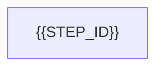

# PLAN: [Nome da feature]

| Campo | Valor |
|-------|--------|
| **PRD** | [caminho portátil do PRD — `STORAGE.md` § Portable path] |
| **Repositório** | [nome do PRD / raiz git] |
| **Stack** | [.NET / Angular / outro] |
| **Complexidade** | Baixa / Média / Alta |
| **Total de passos** | N |
| **Progresso** | 0/N |
| **Track** | Classic SDD / … |
| **Status** | draft \| approved |
| **Implementation status** | `NOT_STARTED` |

## Execution policy

| Field | Value |
|-------|--------|
| **Orchestrator mode** | `always` / `adaptive` (from `{{SDD_ROOT}}/preferences.json`; default `always`) |
| **Parent role** | Orchestrator only — delegate implementation to specialists |
| **Child validation** | After file changes: child runs build + tests; reports `{ build, tests, summary }` |
| **Handoff** | Scoped paths + receipt per `SPAWN.md` — no full PLAN/PRD dump into child prompts |

```
[⚪⚪⚪⚪⚪⚪⚪⚪] 0% (0/N)
```

## Related

| Relação | Path portátil |
|---------|---------------|
| PRD | `features/NNN-slug/USnn/PRD/NNN_….md` |
| STORY | `features/NNN-slug/USnn/STORY.md` (omit if absent) |
| FEATURE | `features/NNN-slug/FEATURE.md` (omit if absent) |
| CONTINUITY | `features/NNN-slug/CONTINUITY.md` (omit if absent) |
| ANALYSIS index | `features/NNN-slug/USnn/ANALYSIS/…` (omit if absent) |
| ARCH | `features/NNN-slug/USnn/ARCH/…` (omit if absent) |

Title **must** be `## Related` (`STORAGE.md` § Navigation block; RN05). Keep in sync with header **PRD** path. Omit-if-absent — do not stub siblings only for links.

## Objetivos

- [ ] O1: [Resultado mensurável ligado a REQ/CA do PRD]
- [ ] O2: [Resultado mensurável]
- [ ] O3: [Opcional]

## Árvore alvo (entregáveis)

```
[caminhos principais — só paths, sem código]
```

## Estratégia de validação

- [ ] [Como verificar — unitário, integração, script, checklist]
- [ ] Retrieval seletivo: skills tocadas não prescritem dump integral de `memory-bank/` nem do PRD (CT5 / `SELECTIVE-RETRIEVAL.md`)
- [ ] Build passa local / CI

## Mapa REQ → passo

| REQ | Passo |
|-----|-------|
| REQ-001 | {{STEP_ID}} |

Every PRD REQ appears. A step's acceptance cites the REQ. Prose in this file follows the chat language (`LANGUAGE.md`). Status tokens stay the English tokens in `status-legend.md`.

## Acceptance traceability

| Criterion | Step | Test | Evidence status |
|-----------|------|------|-----------------|
| {{CRITERION_ID}} | {{STEP_ID}} | {{TEST_ID}} | {{PASS_OR_BLOCKED}} |

One row per PRD criterion. If the cell has no evidence, the evidence status is `BLOCKED`. Do not invent the behavior. If any row stays `BLOCKED`, do not write this PLAN.

## Current implementation evidence

Only paths that were read. Portable paths. Do not invent a file.

## Impact map

| Area | Current behavior | Planned impact |
|------|------------------|----------------|
| {{AREA}} | {{READ_BEHAVIOR}} | {{PLANNED_IMPACT}} |

An area that does not change still needs the justification that was read in the repo.

## Artifacts and symbols

| Path | Action | Label |
|------|--------|-------|
| {{PATH}} | `CREATE` \| `MODIFY` \| `REMOVE` \| `NO_CHANGE` | existing path was read, or `proposed` |

An existing path must have been read. A new path is labeled `proposed`. A validation command appears only when the repo already shows that command. Do not claim the command already ran.

## Dependency and execution graph

One Mermaid `flowchart`. Each node is a step id from `REFINE/tasks.md`, once. No time estimate.



## Passos de implementação

One block per step id from `REFINE/tasks.md`. Copy the id, title, dependencies, and wave. Do not invent a step here.

### {{STEP_ID}}: {{TITLE}}

**Status:** `PENDING` | **Deps:** {{COMPLETED_IDS_OR_NONE}} | **Wave:** {{WAVE}} | **Parallel-safe:** {{YES_OR_NO}}

**Goal:** {{GOAL}}

**Artifacts:** {{CREATE_MODIFY_REMOVE_NO_CHANGE}}

**Tests:** positive, negative, and boundary when the criterion requires them.

**Aceite:** {{ACCEPTANCE_TIED_TO_REQ}}

**Validation command:** {{COMMAND_ALREADY_IN_REPO_OR_OMIT}}

**Step risk:** {{RISK}}

No duration. No production code in this block.

## Test strategy

| Layer | Precondition | Action | Assertion | Required |
|-------|--------------|--------|-----------|----------|
| unit \| integration \| contract \| end-to-end \| manual | {{PRE}} | {{ACTION}} | {{ASSERTION}} | required \| conditional |

## Risks

| Risk | Impact | Evidence | Mitigation |
|------|--------|----------|------------|
| {{RISK}} | {{IMPACT}} | {{PORTABLE_PATH}} | {{MITIGATION}} |

## Open decisions

Leave this section empty in the saved file. A filled line prevents the write.

## Execution checkpoint

| Field | Value |
|-------|--------|
| last mode | `NOT_STARTED` |
| active step | |
| next eligible | |
| portability | `NOT_STARTED` |

Portability tokens: `NOT_STARTED`, `LOCAL_ONLY`, `SHARED`. No tracker tag.

## Ordem de execução

**Caminho crítico:** 1 -> 2 -> … -> N

**Próximo passo:** PASSO 1 - [título]

## Decisões técnicas

| Tópico | Decisão | Justificativa |
|--------|---------|---------------|
| [tópico] | [escolha] | [por quê] |

## Riscos e mitigações

| Risco | Impacto | Mitigação |
|-------|---------|-----------|
| [Risco] | Baixo/Médio/Alto | [Ação] |

## Referências

- PRD: [caminho portátil]
- Retrieval: `skills/_shared/sdd-artifacts/SELECTIVE-RETRIEVAL.md`

## Checklist final

- [ ] Todos os REQ do PRD mapeados em passos
- [ ] Cada passo cabe em uma sessão `sdd-develop`
- [ ] Dependências explícitas; sem ciclos
- [ ] Aceite por passo cita CA/REQ verificáveis
- [ ] Sem código de implementação embutido no PLAN
- [ ] Handoff: `/sdd-develop - <caminho-portátil-do-plan> - Step 1`
