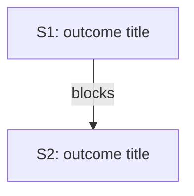

# PLAN: [Nome da feature]

| Campo | Valor |
|-------|--------|
| **PRD** | [caminho portátil do PRD — `STORAGE.md` § Portable path] |
| **Repositório** | [nome do PRD / raiz git] |
| **Stack** | [.NET / Angular / outro] |
| **Complexidade** | Baixa / Média / Alta |
| **Total de passos** | N |
| **Progresso** | 0/N |
| **Track** | Classic SDD / … |
| **Status** | draft \| approved |
| **Implementation status** | `NOT_STARTED` |

## Execution policy

| Field | Value |
|-------|--------|
| **Orchestrator mode** | `always` / `adaptive` (from `{{SDD_ROOT}}/preferences.json`; default `always`) |
| **Parent role** | Orchestrator only — delegate implementation to specialists |
| **Child validation** | After file changes: child runs build + tests; reports `{ build, tests, summary }` |
| **Handoff** | Scoped paths + receipt per `SPAWN.md` — no full PLAN/PRD dump into child prompts |

```
[⚪⚪⚪⚪⚪⚪⚪⚪] 0% (0/N)
```

## Related

| Relação | Path portátil |
|---------|---------------|
| PRD | `features/NNN-slug/USnn/PRD/NNN_….md` |
| STORY | `features/NNN-slug/USnn/STORY.md` (omit if absent) |
| FEATURE | `features/NNN-slug/FEATURE.md` (omit if absent) |
| CONTINUITY | `features/NNN-slug/CONTINUITY.md` (omit if absent) |
| ANALYSIS index | `features/NNN-slug/USnn/ANALYSIS/…` (omit if absent) |
| ARCH | `features/NNN-slug/USnn/ARCH/…` (omit if absent) |

Title **must** be `## Related` (`STORAGE.md` § Navigation block; RN05). Keep in sync with header **PRD** path. Omit-if-absent — do not stub siblings only for links.

## Objectives

- [ ] O1: [Resultado mensurável ligado a REQ/CA do PRD]
- [ ] O2: [Resultado mensurável]
- [ ] O3: [Opcional]

## Target tree

```
[caminhos principais — só paths, sem código]
```

## Validation strategy

- [ ] [Como verificar — unitário, integração, script, checklist]
- [ ] Retrieval seletivo: skills tocadas não prescritem dump integral de `memory-bank/` nem do PRD (CT5 / `SELECTIVE-RETRIEVAL.md`)
- [ ] Build passa local / CI

## REQ -> passo

| REQ | Passo |
|-----|-------|
| REQ-001 | {{STEP_ID}} |

Every PRD REQ appears. A step's acceptance cites the REQ. Prose in this file follows the chat language (`LANGUAGE.md`). Status tokens stay the English tokens in `status-legend.md`.

## Acceptance traceability

| Criterion | Step | Test | Where | Evidence status |
|-----------|------|------|-------|-----------------|
| CA1 | S1 | CT1 | PRD §2 CA, §4 REQ, §10 CT | PASS |

The `Where` cell is the portable PRD path plus the section. One row per PRD criterion. If the cell has no evidence, the evidence status is `BLOCKED`. Do not invent the behavior. If any row stays `BLOCKED`, do not write this PLAN.

## Current implementation evidence

Only paths that were read. Portable paths. Do not invent a file.

## Impact map

| Area | Current behavior | Planned impact |
|------|------------------|----------------|
| {{AREA}} | {{READ_BEHAVIOR}} | {{PLANNED_IMPACT}} |

An area that does not change still needs the justification that was read in the repo.

## Artifacts and symbols

| Path | Action | Label |
|------|--------|-------|
| {{PATH}} | `CREATE` \| `MODIFY` \| `REMOVE` \| `NO_CHANGE` | existing path was read, or `proposed` |

An existing path must have been read. A new path is labeled `proposed`. A validation command appears only when the repo already shows that command. Do not claim the command already ran.

## Dependency and execution graph

One Mermaid `flowchart`. This graph is step order only. It is not a class or file diagram. Every step id from `REFINE/tasks.md` appears once. Every blocking dependency is an arrow whose label is `blocks`. A step with dependency `none` has no incoming arrow. A diagram that only lists nodes and has no arrows is invalid when any step depends on another.


```mermaid
flowchart TD
  S1["S1: outcome title"] -->|blocks| S2["S2: outcome title"]
```

## Implementation progress

Persisted ledger. `sdd-develop` updates status and evidence after each step. `Analysis weight` is qualitative (`Low`, `Medium`, `High`, `Very high`). It is not duration, effort, or story points.

| Step ID | Step | Dependencies | Analysis weight | Status | Evidence |
|---------|------|--------------|-----------------|--------|----------|
| S1 | outcome title | none | Medium | `PENDING` | — |

## Implementation steps

One block per step id from `REFINE/tasks.md`. Copy the id, title, and dependencies. Do not invent a step here. Do not write this file's step list if `REFINE/tasks.md` does not exist. Every step must have at least one `- [ ]` row in `tasks.md` with the same `STEP n`.

Separate each step: a blank line, then the heading, then one field per line, then a `---` rule before the next step. Status glyphs match `LIVE-STAGE-TABLE.md`: `☐` pending, `◐` in progress, `☑` completed, `⊘` closed without success, `⚠` blocked. The status token stays English.

No duration. Do not paste a new method body. A contract signature and a short excerpt of code that already exists (path and line) are anchors, not the implementation.

### STEP 1 — S1: outcome title

☐ `PENDING`

- **Depends on:** none
- **Wave:** 1
- **Parallel-safe:** no
- **Goal:** observable outcome
- **Symbols:** existing type read in the repo, or `ProposedName` (`proposed`)
- **Artifacts:** `CREATE` or `MODIFY` path (`proposed` or existing)
- **Change:** what this step changes, and what it must not touch
- **Signature:** route, method, or DI registration when that is the boundary. Omit the new method body
- **Anchor:** `path/File.cs:line` plus a short excerpt of current code, or `none`
- **Tests:** positive, negative, and boundary when the criterion requires them
- **Acceptance:** the REQ and CA text, not only the id. Where: `features/.../PRD/....md` §2 and §4
- **Task boxes:** `S1` rows in `features/.../REFINE/tasks.md`
- **Validation command:** command already present in the repo, or omit
- **Step risk:** evidence path

---

### STEP 2 — S2: next outcome

☐ `PENDING`

- **Depends on:** S1
- **Wave:** 2
- **Parallel-safe:** no
- **Goal:** observable outcome
- **Symbols:** existing type, or `ProposedName` (`proposed`)
- **Artifacts:** `MODIFY` path (existing)
- **Change:** what this step changes, and what it must not touch
- **Signature:** omit when this step has no new contract boundary
- **Anchor:** `path/File.cs:line`, or `none`
- **Tests:** the case that proves this step
- **Acceptance:** REQ and CA text. Where: PRD path and section
- **Task boxes:** `S2` rows in `REFINE/tasks.md`
- **Validation command:** omit or the repo command
- **Step risk:** evidence path

---

## Test strategy

| Layer | Precondition | Action | Assertion | Required |
|-------|--------------|--------|-----------|----------|
| unit \| integration \| contract \| end-to-end \| manual | {{PRE}} | {{ACTION}} | {{ASSERTION}} | required \| conditional |

## Risks

| Risk | Impact | Evidence | Mitigation |
|------|--------|----------|------------|
| {{RISK}} | {{IMPACT}} | {{PORTABLE_PATH}} | {{MITIGATION}} |

## Open decisions

When none remain, write exactly one sentence in the content-language: `No open decision.` Translate that sentence on Write (`Nenhuma decisão em aberto.` when the chat language is Portuguese). That sentence is not an open decision. Do not leave this heading with an empty body.

## Execution checkpoint

| Field | Value |
|-------|--------|
| last mode | `NOT_STARTED` |
| active step | |
| next eligible | |
| portability | `NOT_STARTED` |

Portability tokens: `NOT_STARTED`, `LOCAL_ONLY`, `SHARED`. No tracker tag.

## Execution order

**Caminho crítico:** 1 -> 2 -> … -> N

**Próximo passo:** PASSO 1 - [título]

## Technical decisions

| Tópico | Decisão | Justificativa |
|--------|---------|---------------|
| [tópico] | [escolha] | [por quê] |

## Delivery risks

| Risco | Impacto | Mitigação |
|-------|---------|-----------|
| [Risco] | Baixo/Médio/Alto | [Ação] |

## References

- PRD: [caminho portátil]
- Retrieval: `skills/_shared/sdd-artifacts/SELECTIVE-RETRIEVAL.md`

## Final checklist

- [ ] Todos os REQ do PRD mapeados em passos
- [ ] Cada passo cabe em uma sessão `sdd-develop`
- [ ] Dependências explícitas; sem ciclos
- [ ] Aceite por passo cita CA/REQ verificáveis
- [ ] Sem código de implementação embutido no PLAN
- [ ] Handoff: `/sdd-develop - <caminho-portátil-do-plan> - Step 1`
