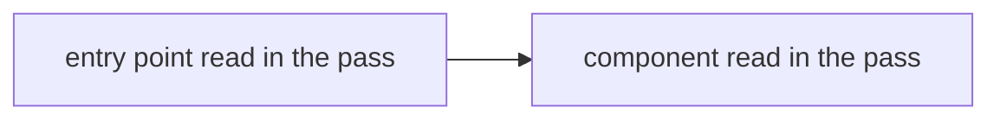

# Report template

The report uses the chat language. Technical names stay as they appear in the code. The headings below stay in English. The terms project shape, system design, and design pattern stay those words.

Open with product reading. Internal detail comes after that block.

Each claim is one of:

- **observed** — cite `path:line` or a diff hunk.
- **inferred** — state what was not in the diff.

Outside a literal code quote, omit the tokens in this list:

```text
"should" "deveria" "Approved" "Approved with reservations" "Changes required" "Aprovado" "Aprovado com ressalvas" "Alterações necessárias" "severity"
```

Build output, test output, and a coverage number stay observed facts. Add no sentence that the result is enough or not enough.

## product reading

The goal of the implementation: the effect observable from outside, read from the diff and the code.

Example of a goal: the endpoint refuses a request that lacks the header and responds 401.

The internal path does not belong in this block. An error branch belongs in behavior.

Short prose. Add a Mermaid flow only when the diff shows a usage path with three or more steps.

## change map

Changed paths in the slice.

| Path | Set | What entered |
|------|-----|----------------|
| `path/to/file` | unstaged, staged, or the diff side | One line of what entered |

## behavior

Internal path, who calls whom, error branches visible in the code, and the observed build result.

Linear path: prose with `path:line`.

A branch, including an error branch, becomes a Mermaid diagram.

## tests

Tests in the slice. No quality note. A failed build or failed tests still leave this block and the other six blocks in the report.

Fill Result with the observed execution result. Leave Result and Coverage empty when the diff was empty and no run started. Leave Coverage empty unless the stack emits the number. Add no sentence that the result or the number is enough or not enough.

| Test | Asserts | Infrastructure | Base | Result | Coverage |
|------|---------|----------------|------|--------|----------|
| Name of the test that exists | What that test asserts | Runner, test project, how it starts | Fixtures, fakers, shared setup | Observed execution result, including a failure | Number only when the stack emits it; otherwise leave the cell empty |

## project shape

Folders and dependency direction.

| Folder | Depends on |
|--------|------------|
| `folder` | `other folder` |

Add a graph only when the direction does not fit the table.

## system design

Entry points and how the components talk. Mermaid.



Replace the nodes with what the pass opened.

## design pattern

Prose. Follow `references/patterns.md`. Name a pattern only when the opened structure shows it. Otherwise write that the pattern is not visible. Do not recommend a pattern.
