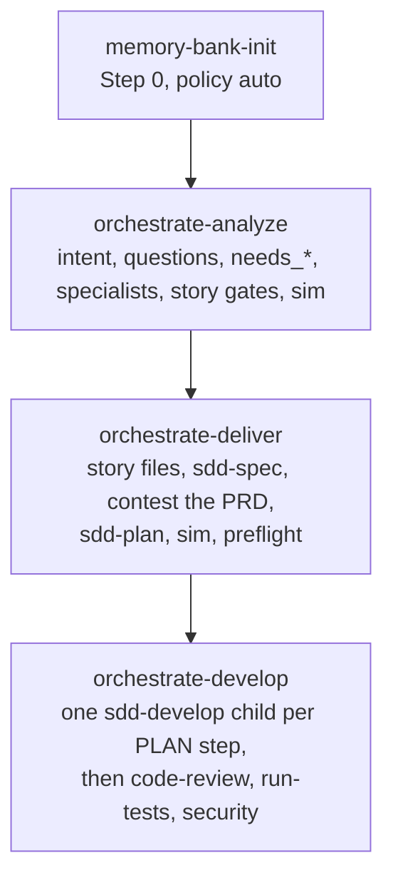
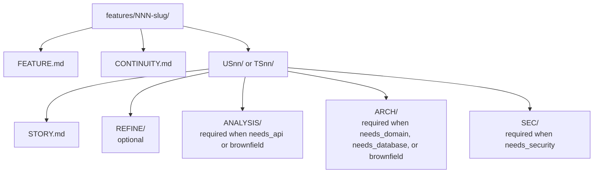

# Orchestrated Delivery

Open the application repo in the agent, then start the feature with `orchestrate-analyze`. This page is that path. Install and sync are on [Get started](get-started.md). Host prefixes are on [Using skills](using-skills.md).

## The first command

Canonical form is the skill id. Cursor and Claude use `/`. Codex and ZCode use `$`. OpenCode uses the `skill` tool.

```text
/orchestrate-analyze
```

```text
$orchestrate-analyze
```

```text
skill({ name: "orchestrate-analyze" })
```

Three skills run in order. Each one refuses the next skill’s job.

| Phase | Skill | Writes | Leaves to the next phase |
|-------|--------|--------|--------------------------|
| O1 explore | `orchestrate-analyze` | `FEATURE.md`, `CONTINUITY.md`, `STORY.md`, specialist folders | PRD, PLAN, application code |
| O2 specify and plan | `orchestrate-deliver` | One PRD and one PLAN per approved story, plus brownfield `CHANGE.md` | Application code |
| O3 apply | `orchestrate-develop` | Nothing in the parent. Each child implements **one** PLAN step | The parent’s own code edits |

O2 loads `sdd-spec`, then `sdd-plan`, once per story. O3 loads `sdd-develop` for one step in each child. A single clear story can still enter those three skills directly. A multi-story, brownfield, or unclear feature stays on this path so specialists, questions, and approval gates run before any PRD.

Contracts: `core/sdd/PIPELINE.md`, `STORAGE.md`, `SESSION.md`, `MEMORY-BANK.md`. Feature root: `features/NNN-slug/`. Memory bank: repository `memory-bank/` or the global classic path. The bank never sits under the feature folder.

These three skills run with invocation context `orchestrated`. A direct `/sdd-spec` is a different context: missing specialist folders become a question. An orchestrated run stops and returns to O1 when a required folder is missing.



The parent writes goals, gates, paths, and receipts. Roster: `core/skills/_shared/agents/ROSTER.md`.

## Where files are stored

The first feature write asks whether to store SDD artifacts **local (repository)** or **global**. That choice sets where `features/` and `memory-bank/` land. Both trees share that root.

| Choice | PRD / PLAN / feature tree | Memory bank |
|--------|---------------------------|-------------|
| Repository | `$Cwd/features/NNN-slug/...` | `$Cwd/memory-bank/` |
| Global | Under `classic.path` on the SDD root (outside the consumer git tree) | Same `<path>/memory-bank/` |

Use portable paths in artifacts and handoffs (`features/NNN-slug/US01/PRD/...`). In **repository** mode the agent may add `/features/` to `.gitignore` when `features_versioned` is false (the default). There is no flat `PRD/` or `PLAN/` at the repo root. Those folders live under `features/NNN-slug/USnn|TSnn/`.

On the first sync, if `preferences.json` is missing, the wizard asks **Always orchestrate** (default) or **Adaptive**.

## Step 0 — memory bank

Before triage, mode selection, or a step queue, the skill runs the Memory Bank Gate (`MEMORY-BANK.md`, policy **auto**).

| Bank state | Action |
|------------|--------|
| Healthy | Selective read. Status `fresh` |
| Missing or stale | Confirm, then `memory-bank-init` create or refresh. Status `created` or `refreshed` |
| Explicit skip flag | Operator-only. The default is to run the gate |

`memory-bank-init` stops when the bank is written. It does not start O1.

| Mode | When |
|------|------|
| `create` | Bank missing or incomplete |
| `refresh` | You asked, or Step 0 marked the bank stale |
| `refresh-light` | O3 Step N after application files changed. Updates generated regions and `tech-stack.json`. Keeps human prose |

MVP files: `project-context.md`, `tech-stack.json`, `architecture.md`, `domain-knowledge.md`, `conventions.md`, `known-risks.md`, plus `.inventory/`. Phase 2 files (`database-schema.md`, `api-contracts.md`, `component-catalog.md`) are written when the repo already has DDL, OpenAPI, or a UI map. Inventory script: `scripts/inventory/Invoke-MemoryBankInventory.ps1`. Confirm before the first write: `sim` / `ajustar` / `cancelar`.

After a greenfield architecture **sim**, O1 point-promotes `memory-bank/architecture.md` and sets bank status `refreshed`.

O3 passes `bank_path` into every develop child as read-only context. Classic SDD alone does not require a bank.

## O1 — `orchestrate-analyze`

Trigger: `/orchestrate-analyze`, or analysis of a complex, multi-story, or brownfield feature. You may paste notes, an existing path, or a prior refine.

### Intent

One primary label (`references/intent-classification.md`):

| Intent | Signals | Default when you do not continue full O1 |
|--------|---------|------------------------------------------|
| Existing Feature | Path under `features/NNN-slug/`, resume | Resume O1, or `/sdd-spec` when one story is already PRD-ready |
| New Feature | Named capability, bounded scope | Classic SDD when medium and one story; `/refine-story` when the item is still informal |
| Product Initiative | Roadmap, several features | Full O1 |
| Problem / Need | Pain, defect, one symptom | `/refine-story` for one item; Classic SDD when the fix is already one clear story |
| Idea | Hypothesis, no acceptance | `/refine-story` or a spike. Re-enter O1 only after refine plus an explicit multi-story or specialist confirm |

Ambiguity: at most three high-cost questions. The parent does not invent scope or architecture.

Full O1 continues for a product initiative, for `complex` work, for several user or technical stories, for several `needs_*` flags, for brownfield blast radius, or when specialist folders are missing. An early exit (Classic SDD, standalone refine, or `/developer`) does not allocate `NNN-slug` and does not run the memory-bank gate, unless you insist on O1 anyway.

That early exit is how a single clear story or a product-only backlog item leaves this skill. The stories, scorecard, and sizing rules for a real feature are produced inside O1.

### Triage

Ask or reuse prior context: goal, current behavior, constraints, known areas. Do not re-ask facts the bank already states.

If you cite a markdown file outside `features/` (including a host plan file), the skill reads it and promotes rich content (DDL, JSON, tables, OpenAPI, diagrams) into bank phase 2 or into `ARCH` / `SEC` / `ANALYSIS`. A citation with no promoted body fails O1. Host plan files are not O3 input.

| Dimension | Values |
|-----------|--------|
| Nature | `greenfield`, `brownfield`, `operational` |
| Complexity | `trivial`, `medium`, `complex` |
| Scope | `backend`, `frontend`, `fullstack` |

`trivial` (one file, clear stack): the skill offers `/developer` or the matching `*-developer`, continue O1 anyway, or cancel. Scaffold happens only if you choose to continue.

`medium`: one story often fits Classic SDD. Multi-story still uses O1.

`complex`: full O1 through approval, then O2.

Unset `needs_*` defaults to false. Auth, secrets, PII, feed tokens, or supply-chain do not default to false: the skill asks or sets `needs_security=true`.

### Feature tree

The next number is the max `NNN` under `features/` plus one. Confirm before the first write.



`PRD/` and `PLAN/` are created in O2. Each written file gets a `## Related` block that cites only siblings already on disk.

### Specialists

Spawn when `subagents=native` and the roster says so. Otherwise the same notes stay with the parent. Story folders, and `ANALYSIS/` / `ARCH/` / `SEC/` under them, are written only after the feature has no open question. Those folders must exist before backlog approval. A note in `CONTINUITY.md` does not replace them. Cap: four concurrent children. The model parameter is omitted (the child uses the parent model). Stack `*-developer` skills are not called in O1.

| Signal | Who | Where the notes go |
|--------|-----|--------------------|
| `needs_api`, or brownfield / unclear impact | `repo-analyst` | `ANALYSIS/` |
| `needs_domain`, greenfield, or brownfield | `architect` | `ARCH/` |
| `needs_database`, or brownfield with persistence | `database` | `ARCH/` database slice |
| `needs_security` | `security` | `SEC/` |
| `needs_frontend` | none | `CONTINUITY.md` only; implementation later via routing |
| `needs_devops` | none | short `CONTINUITY.md` note |
| `qa_checklist` | none | checklist bullets on the story, no child |

Brownfield always includes analyst and architect (mirror the existing style). Greenfield or `needs_domain` without an established style: the architect returns a **draft** only.

Architect draft, in order: boundaries; one recommended style and why; at most two alternatives; at most five open questions; `needs-confirm`. Style selection is Layer A in `core/skills/_shared/code-guidelines/principles/architecture-selection.md` (vertical slice, concentric, DDD tactical on concentric, event-driven overlay, or a frontend hub). Vertical slice is a proposal. You answer **sim** / **ajustar** / **cancelar**. The final ARCH is written only after **sim**.

Optional stage notes: `impact`, `risk`, `generate-story`. They do not add roster roles.

### How stories are shaped

O1 loads the shared backlog rules and the refine scorecard rubric, then writes `STORY.md`. It does not invoke `/refine-story` and it does not ask for feature, tech, or split mode. Story folders wait until `FEATURE.md` has no open question, including **MINOR**.

After specialist notes are merged:

1. **Sizing** (`story-sizing.md`). One story is one verifiable outcome. Merge fragments that differ only by file or layer in the same context. Split when a story would exceed about eight refine steps, has independent consumers, or mixes outcomes.
2. **Promotion gate.** A title that is a verb plus a file, class, or script, or a layer-only label, stays a later PLAN step.
3. **Cap.** At most four stories unless `FEATURE.md` explains why more are required.
4. **Product intent.** User stories get Who / Job / Outcome. Technical stories and bugs may be `n/a`.
5. **FEATURE depth.** Problem (prose), at least one goal, at least one non-goal, and evidence (path, redacted snippet, or an explicit omit). Empty fields keep status `draft`. The human approval prompt is withheld until those fields are filled.
6. **Story file.** Type, objective, which feature acceptance criteria this story covers, out of scope, acceptance in three bands (happy path, rule or edge, failure) with an observable Then, dependencies, and a scorecard mapped from the refine rubric (/100 down to 1–5, including product depth).

The human gate (**sim** / **ajustar** / **cancelar**) runs only after those gates pass and required folders exist. On **sim**, `CONTINUITY.md` records:

```text
/orchestrate-deliver - features/NNN-slug/
```

At about 40% context the skill saves `CONTINUITY.md` and the next chat resumes the same path.

## O2 — `orchestrate-deliver`

Requires an approved backlog (`FEATURE` status approved, or `CONTINUITY` recording **sim**). A still-draft feature stops. The skill does not invent approval.

Step 0 runs again, then:

- Discover `US*/STORY.md` and `TS*/STORY.md`. Skip a story that already has both PRD and PLAN unless you ask to refresh.
- Stop writing if a required `ANALYSIS`, `ARCH`, or `SEC` folder is missing. Return to O1.
- Stop that story if any question is still unanswered on the required story files, on the PRD, or on the plan, including **MINOR**. Stop code `open_question`. Outside those gates, **MINOR** may stay. **sim** does not close a question. Folder presence is not readiness. Readiness is not `step_confirmed`. A stuck story does not erase the others.

Open B/I is `NEEDS_CLARIFICATION`. The handoff is `/refine-story` and/or `/orchestrate-analyze` on the feature path. You answer the question and re-enter O2. Standalone refine comes back here for a blocking question. It is not how a feature normally starts.

### Series or parallel

The skill asks.

| Choice | What happens |
|--------|----------------|
| Series | For each story: story files, then `sdd-spec`, then a contest of that PRD, then `sdd-plan`. Disk write only after that gate is clear and **sim** |
| Parallel | One child per story, draft only, one gate per wave, when `subagents=native`. Cap four. A PLAN is not drafted while that PRD still has an open question. The parent is the only writer, after **sim** |
| Stop | No writes |

If Task is unavailable, parallel falls back to series. Finish stories that others depend on first, unless you waive **story order**. Missing `ANALYSIS` / `ARCH` / `SEC` cannot be waived.

Per story the inputs are `STORY.md`, `REFINE/` when present, the required specialist folders, `FEATURE.md`, `CONTINUITY.md`, and selective bank paths. After both files exist, `## Related` cites PRD and PLAN in both directions.

Brownfield nature also writes `features/NNN-slug/CHANGE.md` (added, modified, removed against current bank docs). Greenfield does not get an empty CHANGE file.

### Approval and preflight

Per story or as a batch: **sim** / **ajustar** / **cancelar**. Then:

- Nature must match CHANGE (brownfield has CHANGE; greenfield does not force one).
- `scripts` preflight `Invoke-PrdPlanChangePreflight.ps1` must allow the handoff.
- A block stops O3. The next chat stays on O2 or returns to O1.

When preflight allows:

```text
/orchestrate-develop - features/NNN-slug/
/sdd-develop - features/NNN-slug/USnn/PLAN/PLAN_NNN_*.md - Step 1
```

The second line is the same contract without the orchestrator. It is valid for one story. Several stories that still need specs stay on O2.

## O3 — `orchestrate-develop`

Requires the feature path or one canonical `PLAN/PLAN_NNN_*.md`. A missing PLAN returns to O2 / `sdd-plan`.

Step 0 runs before the queue. Every child receives `bank_path` read-only and `invocation_context: orchestrated`.

### Two independent controls

| Control | Values | Default |
|---------|--------|---------|
| Execution mode | `serial`, `parallel`, `manual` | `serial` |
| Develop pacing | `step_by_step`, `continuous` | `step_by_step` |

`orchestrator_mode` in preferences is the parent role. It is separate from this table.

`serial` forbids a parallel wave. `parallel` needs an explicit **sim**, independent steps, and a distinct session file per child, cap four. `manual` does not spawn; it prints `/sdd-develop` lines only.

`step_by_step` asks **sim** before each spawn. `continuous` may take the next ready step after the first queue **sim**, still claims the ledger, and still runs one step per child. The parent still shows each step’s summary. It does not stay silent between steps.

### One child, one PLAN step

Before implement:

- `scripts/session/Invoke-DevelopSessionGate.ps1` stores `step_confirmed` on the plan-scoped session file
- `scripts/ledger/Invoke-PlanLedgerClaim.ps1 -Action claim` when a claim is required

A second claim of the same step fails and is audited. Mode violations are audited under the sessions ledger.

The child follows `sdd-develop`: branch, code, targeted tests, optional evidence (`EVD/` + `STATE.md` + `validate-evidence`), and TRACE archive only when the feature wave is closing. Evidence and TRACE are scripts inside that child.

`verify_mode: true` in preferences adds a read-only verifier child after a successful implementer and before `CONTINUITY` is updated. The default is false.

The parent updates `CONTINUITY.md` only after the child returns. Failure leaves the step `PENDING` or `BLOCKED` with the cause in the PLAN. The next step is a new chat, or another **sim**. The parent does not mark steps the child did not finish, and does not call `*-developer` to implement a PLAN step. If Task is missing, the handoff is manual `/sdd-develop` for that step.

### After code exists

When a child changed application files, O3 asks, then runs `memory-bank-init` **refresh-light**.

When the story or feature is done, the close order is `code-review`, then `run-tests`, then a security pass, then `/commit`, then `/push`. `test-coverage` remains the .NET Coverlet report. `run-tests` does not replace it.

A small change, one file, when analyze offers the shortcut:

```text
developer
```

or a stack skill such as `dotnet-developer` or `react-developer`.

## What this path reuses

| Other skill | How Orchestrated Delivery uses it |
|-------------|-----------------------------------|
| `sdd-spec` | O2, per story, after **sim** |
| `sdd-plan` | O2, after that story’s PRD has no open question. Copies step ids from `split-story-checklist` |
| `sdd-develop` | O3 child, one PLAN step; or the manual line when Task is off |
| `refine-story` rubric file | O1 scorecard on `STORY.md`. The refine skill’s mode question is not asked |
| `refine-story` invoke | An open question at those gates, or a product person shaping one item outside a feature |
| `split-story-checklist` | Called by `sdd-plan` to write `REFINE/tasks.md`. O1 may still check the five-group cap |
| `memory-bank-init` | Step 0 and O3 Step N |
| `code-review` | First handoff when implementation of a story or feature is done |
| `run-tests` | After `code-review`, before the security pass. Does not replace `test-coverage` |
| `developer` / `*-developer` | Trivial triage shortcut only. Not the O3 implementer |
| `read-sdd-artifact` | Normalizes a FEATURE, STORY, PRD, or PLAN path into `source_context` for a child |

## Confirmations

| Moment | Answers |
|--------|---------|
| Start the skill | **sim** |
| Write the feature tree | **sim** / **ajustar** / **cancelar** |
| Approve architecture (greenfield) | **sim** / **ajustar** / **cancelar** |
| Approve the backlog | **sim** / **ajustar** / **cancelar** |
| Write each PRD and PLAN | **sim** |
| Spawn the next implementer | **sim** (every step in `step_by_step`; queue **sim** then per-step claim in `continuous`) |
| Memory-bank write or refresh-light | **sim** |

Silence, “ok”, or an emoji is not **sim**.

Next: [Using skills](using-skills.md).
