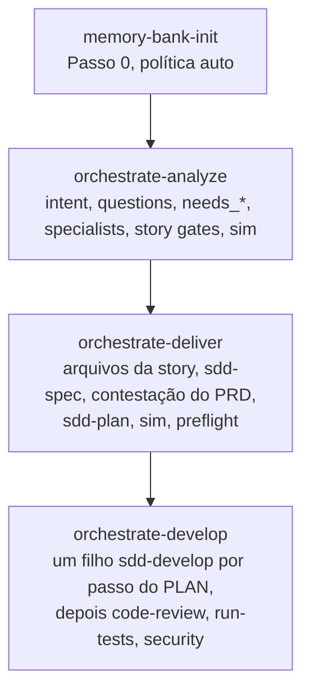
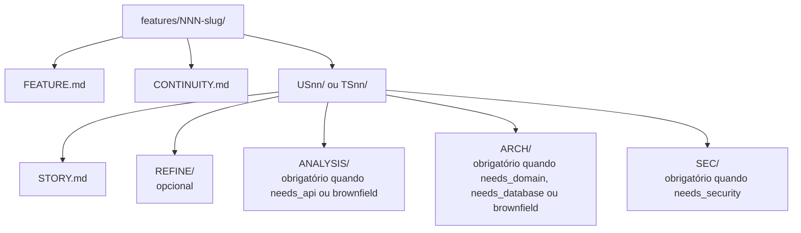

# Entrega orquestrada

Abra o repositório da aplicação no agente e comece a feature com `orchestrate-analyze`. Esta página é esse caminho. Instalação e sync estão em [Começar](get-started.md). Prefixos do host estão em [Usando skills](using-skills.md).

## O primeiro comando

A forma canônica é o id da skill. Cursor e Claude usam `/`. Codex e ZCode usam `$`. OpenCode usa a ferramenta `skill`.

```text
/orchestrate-analyze
```

```text
$orchestrate-analyze
```

```text
skill({ name: "orchestrate-analyze" })
```

Três skills rodam em ordem. Cada uma recusa o trabalho da próxima.

| Fase | Skill | Escreve | Deixa para a fase seguinte |
|------|--------|---------|----------------------------|
| O1 explorar | `orchestrate-analyze` | `FEATURE.md`, `CONTINUITY.md`, `STORY.md`, pastas de especialistas | PRD, PLAN, código de aplicação |
| O2 especificar e planejar | `orchestrate-deliver` | Um PRD e um PLAN por story aprovada, mais `CHANGE.md` em brownfield | Código de aplicação |
| O3 aplicar | `orchestrate-develop` | Nada no pai. Cada filho implementa **um** passo do PLAN | Edições de código feitas pelo próprio pai |

O2 carrega `sdd-spec` e depois `sdd-plan`, uma vez por story. O3 carrega `sdd-develop` para um passo em cada filho. Uma story única e clara ainda pode entrar nessas três skills direto. Uma feature com várias stories, brownfield ou pouco clara permanece neste caminho, para especialistas, perguntas e gates de aprovação rodarem antes de qualquer PRD.

Contratos: `core/sdd/PIPELINE.md`, `STORAGE.md`, `SESSION.md`, `MEMORY-BANK.md`. Raiz da feature: `features/NNN-slug/`. Memory bank: `memory-bank/` do repositório ou o caminho classic global. O bank nunca fica sob a pasta da feature.

Essas três skills rodam com contexto de invocação `orchestrated`. Um `/sdd-spec` direto é outro contexto: pastas de especialista ausentes viram uma pergunta. Uma execução orquestrada para e volta ao O1 quando uma pasta obrigatória falta.



O pai escreve metas, gates, caminhos e recibos. Roster: `core/skills/_shared/agents/ROSTER.md`.

## Onde os arquivos ficam

A primeira escrita da feature pergunta se os artefatos SDD ficam **local (repository)** ou **global**. Essa escolha define onde `features/` e `memory-bank/` caem. As duas árvores compartilham essa raiz.

| Escolha | PRD / PLAN / árvore da feature | Memory bank |
|---------|--------------------------------|-------------|
| Repository | `$Cwd/features/NNN-slug/...` | `$Cwd/memory-bank/` |
| Global | Sob `classic.path` na raiz SDD (fora da árvore git do consumidor) | O mesmo `<path>/memory-bank/` |

Use caminhos portáteis nos artefatos e nos handoffs (`features/NNN-slug/US01/PRD/...`). No modo **repository** o agente pode acrescentar `/features/` ao `.gitignore` quando `features_versioned` é false (o padrão). Não há `PRD/` nem `PLAN/` soltos na raiz do repositório. Essas pastas ficam em `features/NNN-slug/USnn|TSnn/`.

No primeiro sync, se `preferences.json` não existir, o assistente pergunta **Always orchestrate** (padrão) ou **Adaptive**.

## Passo 0 — memory bank

Antes da triagem, da escolha de modo ou de uma fila de passos, a skill roda o Memory Bank Gate (`MEMORY-BANK.md`, política **auto**).

| Estado do bank | Ação |
|----------------|------|
| Saudável | Leitura seletiva. Status `fresh` |
| Ausente ou desatualizado | Confirme, depois `memory-bank-init` create ou refresh. Status `created` ou `refreshed` |
| Flag explícita de pular | Só o operador. O padrão é rodar o gate |

`memory-bank-init` para quando o bank está escrito. Ela não inicia o O1.

| Modo | Quando |
|------|--------|
| `create` | Bank ausente ou incompleto |
| `refresh` | Você pediu, ou o Passo 0 marcou o bank como desatualizado |
| `refresh-light` | Passo N do O3 depois que arquivos de aplicação mudaram. Atualiza regiões geradas e `tech-stack.json`. Mantém a prosa humana |

Arquivos MVP: `project-context.md`, `tech-stack.json`, `architecture.md`, `domain-knowledge.md`, `conventions.md`, `known-risks.md`, mais `.inventory/`. Arquivos da fase 2 (`database-schema.md`, `api-contracts.md`, `component-catalog.md`) são escritos quando o repositório já tem DDL, OpenAPI ou um mapa de UI. Script de inventário: `scripts/inventory/Invoke-MemoryBankInventory.ps1`. Confirme antes da primeira escrita: `sim` / `ajustar` / `cancelar`.

Depois de um **sim** de arquitetura greenfield, o O1 promove pontualmente `memory-bank/architecture.md` e define o status do bank como `refreshed`.

O O3 passa `bank_path` para cada filho de develop como contexto somente leitura. Classic SDD sozinho não exige um bank.

## O1 — `orchestrate-analyze`

Gatilho: `/orchestrate-analyze`, ou a análise de uma feature complexa, com várias stories, ou brownfield. Você pode colar notas, um caminho existente ou um refine anterior.

### Intenção

Um rótulo primário (`references/intent-classification.md`):

| Intenção | Sinais | Padrão quando você não segue o O1 completo |
|----------|--------|-----------------------------------------------|
| Existing Feature | Caminho em `features/NNN-slug/`, retomada | Retomar o O1, ou `/sdd-spec` quando uma story já está pronta para PRD |
| New Feature | Capacidade nomeada, escopo limitado | Classic SDD quando é médio e uma story; `/refine-story` quando o item ainda é informal |
| Product Initiative | Roadmap, várias features | O1 completo |
| Problem / Need | Dor, defeito, um sintoma | `/refine-story` para um item; Classic SDD quando a correção já é uma story clara |
| Idea | Hipótese, sem aceite | `/refine-story` ou um spike. Volte ao O1 só depois do refine e de uma confirmação explícita de várias stories ou de especialistas |

Ambiguidade: no máximo três perguntas de alto custo. O pai não inventa escopo nem arquitetura.

O O1 completo segue para uma iniciativa de produto, trabalho `complex`, várias stories de usuário ou técnicas, várias flags `needs_*`, raio de explosão brownfield, ou quando pastas de especialista faltam. Uma saída antecipada (Classic SDD, refine avulso ou `/developer`) não aloca `NNN-slug` e não roda o gate do memory bank, a menos que você insista no O1 mesmo assim.

Essa saída antecipada é como uma story única e clara, ou um item só de produto, deixa esta skill. As stories, o scorecard e as regras de tamanho de uma feature de verdade são produzidos dentro do O1.

### Triagem

Pergunte ou reutilize o contexto anterior: meta, comportamento atual, restrições, áreas conhecidas. Não pergunte de novo fatos que o bank já declara.

Se você citar um markdown fora de `features/` (incluindo um arquivo de plano do host), a skill lê o arquivo e promove conteúdo rico (DDL, JSON, tabelas, OpenAPI, diagramas) para a fase 2 do bank ou para `ARCH` / `SEC` / `ANALYSIS`. Uma citação sem corpo promovido falha o O1. Arquivos de plano do host não são entrada do O3.

| Dimensão | Valores |
|----------|---------|
| Natureza | `greenfield`, `brownfield`, `operational` |
| Complexidade | `trivial`, `medium`, `complex` |
| Escopo | `backend`, `frontend`, `fullstack` |

`trivial` (um arquivo, stack clara): a skill oferece `/developer` ou o `*-developer` correspondente, continuar o O1 mesmo assim, ou cancelar. O scaffold só acontece se você escolher continuar.

`medium`: uma story em geral cabe em Classic SDD. Várias stories ainda usam O1.

`complex`: O1 completo até a aprovação, depois O2.

`needs_*` não definidas valem false. Auth, segredos, PII, tokens de feed ou supply-chain não caem em false: a skill pergunta ou define `needs_security=true`.

### Árvore da feature

O próximo número é o maior `NNN` em `features/` mais um. Confirme antes da primeira escrita.



`PRD/` e `PLAN/` são criados no O2. Cada arquivo escrito ganha um bloco `## Related` que cita só irmãos já no disco.

### Especialistas

Há spawn quando `subagents=native` e o roster manda. Caso contrário as mesmas notas ficam com o pai. Pastas de story, e `ANALYSIS/` / `ARCH/` / `SEC/` sob elas, são escritas só depois que a feature não tem pergunta aberta. Essas pastas precisam existir antes da aprovação do backlog. Uma nota em `CONTINUITY.md` não as substitui. Teto: quatro filhos simultâneos. O parâmetro de modelo é omitido (o filho usa o modelo do pai). Skills de stack `*-developer` não são chamadas no O1.

| Sinal | Quem | Onde as notas vão |
|-------|------|-------------------|
| `needs_api`, ou brownfield / impacto pouco claro | `repo-analyst` | `ANALYSIS/` |
| `needs_domain`, greenfield ou brownfield | `architect` | `ARCH/` |
| `needs_database`, ou brownfield com persistência | `database` | fatia de banco em `ARCH/` |
| `needs_security` | `security` | `SEC/` |
| `needs_frontend` | nenhum | só `CONTINUITY.md`; implementação depois, via roteamento |
| `needs_devops` | nenhum | nota curta em `CONTINUITY.md` |
| `qa_checklist` | nenhum | bullets de checklist na story, sem filho |

Brownfield sempre inclui analyst e architect (espelha o estilo existente). Greenfield ou `needs_domain` sem estilo estabelecido: o architect devolve só um **rascunho**.

Rascunho do architect, nesta ordem: fronteiras; um estilo recomendado e o porquê; no máximo duas alternativas; no máximo cinco perguntas abertas; `needs-confirm`. A seleção de estilo é a Camada A em `core/skills/_shared/code-guidelines/principles/architecture-selection.md` (vertical slice, concentric, DDD tático sobre concentric, overlay event-driven ou um hub de frontend). Vertical slice é uma proposta. Você responde **sim** / **ajustar** / **cancelar**. O ARCH final só é escrito depois do **sim**.

Notas de estágio opcionais: `impact`, `risk`, `generate-story`. Elas não acrescentam papéis ao roster.

### Como as stories são formadas

O O1 carrega as regras compartilhadas de backlog e a rubrica do scorecard de refine, e então escreve `STORY.md`. Ele não invoca `/refine-story` e não pergunta o modo feature, tech ou split. Pastas de story esperam até `FEATURE.md` não ter pergunta aberta, inclusive **MINOR**.

Depois que as notas dos especialistas se juntam:

1. **Tamanho** (`story-sizing.md`). Uma story é um resultado verificável. Una fragmentos que diferem só por arquivo ou camada no mesmo contexto. Divida quando uma story passaria de cerca de oito passos de refine, tiver consumidores independentes ou misturar resultados.
2. **Gate de promoção.** Um título que é verbo mais arquivo, classe ou script, ou um rótulo só de camada, fica como passo posterior do PLAN.
3. **Teto.** No máximo quatro stories, salvo se `FEATURE.md` explicar por que mais são necessárias.
4. **Intenção de produto.** User stories ganham Who / Job / Outcome. Stories técnicas e bugs podem ser `n/a`.
5. **Profundidade da FEATURE.** Problema (prosa), pelo menos uma meta, pelo menos um não-objetivo e evidência (caminho, trecho redigido ou uma omissão explícita). Campos vazios mantêm o status `draft`. O prompt de aprovação humana espera esses campos preenchidos.
6. **Arquivo da story.** Tipo, objetivo, quais critérios de aceite da feature esta story cobre, fora de escopo, aceite em três faixas (caminho feliz, regra ou borda, falha) com um Then observável, dependências e um scorecard mapeado da rubrica de refine (/100 até 1–5, incluindo profundidade de produto).

O gate humano (**sim** / **ajustar** / **cancelar**) só roda depois que esses gates passam e as pastas obrigatórias existem. No **sim**, `CONTINUITY.md` registra:

```text
/orchestrate-deliver - features/NNN-slug/
```

Com cerca de 40% de contexto a skill grava `CONTINUITY.md` e o chat seguinte retoma o mesmo caminho.

## O2 — `orchestrate-deliver`

Exige um backlog aprovado (status da `FEATURE` approved, ou `CONTINUITY` registrando **sim**). Uma feature ainda em rascunho para. A skill não inventa aprovação.

O Passo 0 roda de novo, e então:

- Descobre `US*/STORY.md` e `TS*/STORY.md`. Pula uma story que já tem PRD e PLAN, salvo se você pedir refresh.
- Para de escrever se uma pasta obrigatória `ANALYSIS`, `ARCH` ou `SEC` faltar. Volta ao O1.
- Para essa story se ainda houver pergunta sem resposta nos arquivos obrigatórios da story, no PRD ou no plano, inclusive **MINOR**. Código de parada `open_question`. Fora desses gates, **MINOR** pode ficar. **sim** não fecha uma pergunta. A presença da pasta não é prontidão. Prontidão não é `step_confirmed`. Uma story travada não apaga as outras.

B/I aberto é `NEEDS_CLARIFICATION`. O handoff é `/refine-story` e/ou `/orchestrate-analyze` no caminho da feature. Você responde a pergunta e volta ao O2. O refine avulso volta aqui para uma pergunta bloqueante. Não é assim que uma feature começa no caso comum.

### Série ou paralelo

A skill pergunta.

| Escolha | O que acontece |
|---------|----------------|
| Série | Por story: arquivos da story, depois `sdd-spec`, depois a contestação desse PRD, depois `sdd-plan`. Escrita em disco só depois que esse gate está limpo e há **sim** |
| Paralelo | Um filho por story, só rascunho, um gate por onda, quando `subagents=native`. Teto quatro. O PLAN não é rascunhado enquanto esse PRD ainda tiver pergunta aberta. O pai é o único que escreve, depois do **sim** |
| Parar | Sem escritas |

Se Task não estiver disponível, o paralelo cai para série. Termine primeiro as stories das quais outras dependem, salvo se você dispensar **story order**. `ANALYSIS` / `ARCH` / `SEC` ausentes não podem ser dispensados.

Por story as entradas são `STORY.md`, `REFINE/` quando existir, as pastas de especialista obrigatórias, `FEATURE.md`, `CONTINUITY.md` e caminhos seletivos do bank. Depois que os dois arquivos existem, `## Related` cita PRD e PLAN nos dois sentidos.

Natureza brownfield também escreve `features/NNN-slug/CHANGE.md` (adicionado, modificado, removido contra os docs atuais do bank). Greenfield não ganha um CHANGE vazio.

### Aprovação e preflight

Por story ou em lote: **sim** / **ajustar** / **cancelar**. Depois:

- A natureza precisa bater com CHANGE (brownfield tem CHANGE; greenfield não força um).
- O preflight `Invoke-PrdPlanChangePreflight.ps1` em `scripts` precisa liberar o handoff.
- Um bloqueio impede o O3. O chat seguinte fica no O2 ou volta ao O1.

Quando o preflight libera:

```text
/orchestrate-develop - features/NNN-slug/
/sdd-develop - features/NNN-slug/USnn/PLAN/PLAN_NNN_*.md - Step 1
```

A segunda linha é o mesmo contrato sem o orquestrador. Ela vale para uma story. Várias stories que ainda precisam de spec ficam no O2.

## O3 — `orchestrate-develop`

Exige o caminho da feature ou um `PLAN/PLAN_NNN_*.md` canônico. PLAN ausente volta ao O2 / `sdd-plan`.

O Passo 0 roda antes da fila. Cada filho recebe `bank_path` somente leitura e `invocation_context: orchestrated`.

### Dois controles independentes

| Controle | Valores | Padrão |
|----------|---------|--------|
| Modo de execução | `serial`, `parallel`, `manual` | `serial` |
| Ritmo de develop | `step_by_step`, `continuous` | `step_by_step` |

`orchestrator_mode` nas preferências é o papel do pai. Ele fica separado desta tabela.

`serial` impede uma onda paralela. `parallel` precisa de um **sim** explícito, passos independentes e um arquivo de sessão distinto por filho, teto quatro. `manual` não faz spawn; só imprime linhas `/sdd-develop`.

`step_by_step` pede **sim** antes de cada spawn. `continuous` pode pegar o próximo passo pronto depois do primeiro **sim** da fila, ainda reivindica o ledger e ainda roda um passo por filho. O pai ainda mostra o resumo de cada passo. Não fica em silêncio entre passos.

### Um filho, um passo do PLAN

Antes de implementar:

- `scripts/session/Invoke-DevelopSessionGate.ps1` grava `step_confirmed` no arquivo de sessão daquele plano
- `scripts/ledger/Invoke-PlanLedgerClaim.ps1 -Action claim` quando uma reivindicação é necessária

Uma segunda reivindicação do mesmo passo falha e é auditada. Violações de modo são auditadas no ledger de sessões.

O filho segue `sdd-develop`: branch, código, testes direcionados, evidência opcional (`EVD/` + `STATE.md` + `validate-evidence`) e arquivo TRACE só quando a onda da feature fecha. Evidência e TRACE são scripts dentro desse filho.

`verify_mode: true` nas preferências acrescenta um filho verificador somente leitura depois de um implementador bem-sucedido e antes de `CONTINUITY` ser atualizado. O padrão é false.

O pai atualiza `CONTINUITY.md` só depois que o filho volta. Falha deixa o passo `PENDING` ou `BLOCKED`, com a causa no PLAN. O próximo passo é um chat novo, ou outro **sim**. O pai não marca passos que o filho não terminou e não chama `*-developer` para implementar um passo do PLAN. Se Task faltar, o handoff é `/sdd-develop` manual para aquele passo.

### Depois que o código existe

Quando um filho alterou arquivos de aplicação, o O3 pergunta e então roda `memory-bank-init` **refresh-light**.

Quando a story ou a feature termina, a ordem de fechamento é `code-review`, depois `run-tests`, depois a passagem de security, depois `/commit` e então `/push`. `test-coverage` continua sendo o relatório Coverlet .NET. `run-tests` não o substitui.

Uma mudança pequena, um arquivo, quando o analyze oferece o atalho:

```text
developer
```

ou uma skill de stack como `dotnet-developer` ou `react-developer`.

## O que este caminho reutiliza

| Outra skill | Como a Orchestrated Delivery a usa |
|-------------|-------------------------------------|
| `sdd-spec` | O2, por story, depois do **sim** |
| `sdd-plan` | O2, depois que o PRD dessa story não tem pergunta aberta. Copia os ids de passo de `split-story-checklist` |
| `sdd-develop` | Filho do O3, um passo do PLAN; ou a linha manual quando Task está desligado |
| Arquivo da rubrica de `refine-story` | Scorecard do O1 em `STORY.md`. A pergunta de modo da skill refine não é feita |
| Invocação de `refine-story` | Uma pergunta aberta nesses gates, ou uma pessoa de produto formando um item fora de uma feature |
| `split-story-checklist` | Chamada por `sdd-plan` para gravar `REFINE/tasks.md`. O O1 ainda pode checar o teto de cinco grupos |
| `memory-bank-init` | Passo 0 e Passo N do O3 |
| `code-review` | Primeiro handoff quando a implementação de uma story ou feature termina |
| `run-tests` | Depois de `code-review`, antes da passagem de security. Não substitui `test-coverage` |
| `developer` / `*-developer` | Só o atalho da triagem trivial. Não é o implementador do O3 |
| `read-sdd-artifact` | Normaliza um caminho FEATURE, STORY, PRD ou PLAN em `source_context` para um filho |

## Confirmações

| Momento | Respostas |
|---------|-----------|
| Iniciar a skill | **sim** |
| Escrever a árvore da feature | **sim** / **ajustar** / **cancelar** |
| Aprovar a arquitetura (greenfield) | **sim** / **ajustar** / **cancelar** |
| Aprovar o backlog | **sim** / **ajustar** / **cancelar** |
| Escrever cada PRD e PLAN | **sim** |
| Fazer spawn do próximo implementador | **sim** (cada passo em `step_by_step`; **sim** da fila e depois claim por passo em `continuous`) |
| Escrita ou refresh-light do memory bank | **sim** |

Silêncio, “ok” ou um emoji não é **sim**.

Próximo: [Usando skills](using-skills.md).
