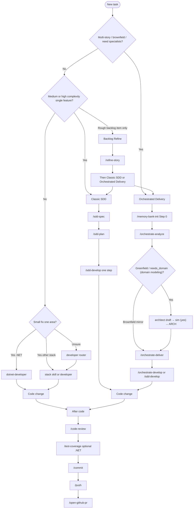

# Using skills

Invoke toolkit skills after a successful sync. Prefer **skill ids** (kebab-case folder names under `core/skills/`). The **id** is stable across hosts; the prefix is host-specific (`/`, `$`, `use skill`, OpenCode `skill` tool, or OpenHands skill `name`). Compat: `use skill <id>` or natural language matching the skill `description`.

After any agent sync, invoke skill **`help-skills`** for the installed static catalog (`CATALOG.md` + `OPERATOR.md`) — do not load every `SKILL.md`.

**Not skill invoke:** Codex `/hooks` and Grok `/hooks-trust` are hooks trust UI. There is no Codex `$skill --menu` product flag — `$` / `/skills` is the native skills picker.

## Canonical invoke matrix

| Host | Skills path (live, typical) | Explicit form | Example |
|------|-----------------------------|----------------|---------|
| Cursor | `~/.cursor/skills` | `/id` | `/help-skills` |
| Claude | `~/.claude/skills` | `/id` | `/sdd-spec` |
| Codex | `~/.codex/skills` (+ optional `~/.agents/skills`) | `$id` | `$help-skills` |
| Copilot | `~/.copilot/skills` or `<repo>/.github/skills` | `/id` (+ `/skills reload` after sync) | `/dotnet-developer` |
| OpenCode | `~/.config/opencode/skills` | `skill` tool | `skill({ name: "help-skills" })` |
| Antigravity | `~/.gemini/config/skills` | `use skill id` or `/id` | `use skill sdd-plan` |
| Grok | `~/.grok/skills` | `/id` | `/help-skills` |
| ZCode | `~/.zcode/skills` | `$id` | `$help-skills` |
| Hermes | `~/.hermes/skills` | `/id` | `/help-skills` |
| OpenHands | `.agents/skills` (project) / `~/.agents/skills` (user) | skill `name` (agent loads when relevant) | `help-skills` |

## Parallel specialists (default)

After sync, the published router asks agents to prefer **parallel specialist subagents** for planning, multi-facet execution, analysis, or non-trivial questions, keeping **this session as the parent**. Trivial / single-path work stays in-parent.

- **`needs_*` → roster** — which roles to spawn: [ROSTER.md](https://github.com/tibursocampos/agent-dev-toolkit/blob/master/core/skills/_shared/agents/ROSTER.md)
- **Task `model`** — omit by default (child inherits the parent session model); see [SUBAGENT-MODEL.md](https://github.com/tibursocampos/agent-dev-toolkit/blob/master/core/skills/_shared/agents/SUBAGENT-MODEL.md)
- **Orchestrator parent** — this session stays lean (goals, gates, paths, receipts); **no application code** in the parent when specialists run
- **Caps** — `*-developer` children **≤ 2**; `orchestrate-*` parallel **≤ 4** (wave if more). Fallback when `subagents=none`: in-parent, never hard-fail — [docs/SPAWN.md](https://github.com/tibursocampos/agent-dev-toolkit/blob/master/docs/SPAWN.md) · [Architecture](../architecture/)
- **Language surfaces** — user chat + persisted artifacts match the chat language; child prompts and agent receipts stay **en-US** ([LANGUAGE.md](https://github.com/tibursocampos/agent-dev-toolkit/blob/master/core/skills/_shared/agents/LANGUAGE.md))

## Prerequisites

1. Synced at least one agent — see [Get started](../get-started/).
2. Opened an **application project** (the project you are building) in that agent — not only this toolkit repo.
3. Optional: validated with `toolkit.ps1 -Action Validate -Agent <id>`.

## Which workflow (work track) / skill?



**ASCII summary:**

```
New task
  ├─ Multi-story / brownfield?     -> Orchestrated Delivery: memory-bank-init → analyze → deliver → develop
  ├─ Greenfield / needs_domain?    -> Orchestrated Delivery: analyze (+ architect confirm) before develop
  ├─ Single medium/high feature?   -> Classic SDD: sdd-spec → sdd-plan → sdd-develop
  ├─ Rough backlog item?           -> Backlog Refine: refine-story → checklist? → Classic or Orchestrated
  ├─ Small stack change?           -> *-developer or developer
  └─ After code                    -> code-review → test-coverage? → commit → push → open-github-pr
```

### Work tracks

| Track | When | Pipeline | Notes |
|-------|------|----------|-------|
| **Classic SDD** *(formerly Forma A)* | One clear feature | `sdd-spec` → `sdd-plan` → `sdd-develop` | No memory-bank required |
| **Backlog Refine** *(formerly Forma B)* | Informal bug/story | `refine-story` → optional `split-story-checklist` → Classic or Orchestrated | Prepares structured markdown |
| **Orchestrated Delivery** *(formerly Forma C)* | Multi-story / brownfield / greenfield domain | `memory-bank-init` → analyze → deliver → develop | Analyze may run architect confirm; deliver/develop reuse Classic SDD |

Same skill call flow; internal contracts (REQ, validate, CHANGE, EVD, STATE, TRACE) add gates/artifacts only — not a second toolkit. SQLite/FTS is not a deliverable.

For greenfield domain work, prefer Orchestrated Delivery *(formerly Forma C)*. `orchestrate-analyze` can start the roster **architect** specialist (not a skill id). That path drafts ARCH → you answer **sim** (yes / confirm) → ARCH is approved, then implementers run. For brownfield work, prefer discovery first (**discover-first**): mirror the existing ARCH instead of re-picking.

## Invoke by agent

Skill **`help-skills`** works on **every** synced adapter (not Codex-only). Use the host form from the matrix above.

### Cursor

Skills: `~/.cursor/skills/<id>/SKILL.md`. Rules: `~/.cursor/rules/*.mdc`. Router: `AGENTS.md`.

| Action | Example |
|--------|---------|
| Slash menu | `/sdd-spec` |
| With args | `/sdd-plan - path/to/PRD.md` |
| Stack router | `/developer` |
| Catalog | `/help-skills` |
| Orchestrated Delivery Step 0 | `/memory-bank-init` |

Also Customize → Skills. Trust hooks in Cursor’s UI once if prompted (outside CI).

### Claude Code

Skills under `~/.claude/skills/` (or project `.claude/`). Router: `CLAUDE.md`. Invoke with `/id` (e.g. `/sdd-spec`, `/help-skills`).

### GitHub Copilot

Sync with `-Mode user` or `-Mode repo`:

| Mode | Skills / instructions |
|------|------------------------|
| `user` | `~/.copilot/skills`, `instructions/`, `copilot-instructions.md` |
| `repo` | `<repo>/.github/skills`, … |

Invoke with `/id`. After sync, run **`/skills reload`**. Catalog: `help-skills`.

### Codex

Codex is **dual-root** for packaging vs rules. **Plugin path alone does not feed `$`.**

| Surface | Location |
|---------|----------|
| Plugin skills + CATALOG + OPERATOR | Under `InstallRoot/plugin` (packaging) |
| **`$` discovery** | Live `~/.codex/skills` (InstallRoot skills mirror) |
| Rules (Publish-Policy) | `InstallRoot/rules/*.md` |
| Product / AGENTS / hooks | `InstallRoot` (live `~/.codex`) |
| Optional UserScope (opt-in) | Fixture `InstallRoot/.agents/skills` · live `~/.agents/skills` |

Invoke with **`$id`** (e.g. `$help-skills`). Native `$` / `/skills` picker is the product menu — not a `--menu` flag. Trust hooks with Codex `/hooks` after a real install (trust UI, not skill invoke).

### OpenCode

Skills: `~/.config/opencode/skills`. Invoke via the **`skill` tool**: `skill({ name: "help-skills" })`. JS plugins under `plugins/`.

### Grok

Expected live path: `~/.grok/skills`. Invoke with `/id` (e.g. `/help-skills`). Hooks trust via `/hooks-trust` if needed (not skill invoke).

### ZCode

Skills: `~/.zcode/skills`. Invoke with **`$id`** (e.g. `$help-skills`). Refresh in Settings → Skills if needed.

### Antigravity

Skills: `~/.gemini/config/skills`. Invoke with **`use skill <id>`** or `/id` (e.g. `use skill sdd-plan`).

### Hermes

Skills: `~/.hermes/skills`. Invoke with **`/id`** (e.g. `/help-skills`). Official: every installed skill is a slash command. Subagents: host `delegate_task` (`subagents=native`). No `agents/*.md` roster.

### OpenHands

Project skills: `.agents/skills`. Live user skills: `~/.agents/skills`. The agent loads a skill by `name` / `description` when relevant (optional frontmatter `triggers`). Do not treat Canvas as subagents — `subagents=none`; SPAWN fallback is in-parent. Published `.agents/agents/*.md` is an SDK/plugin roster, not Canvas Profile.

Per-agent publish layouts: [Adapters](../adapters/). All publish `help-skills` + the skills-catalog pack.

## Common workflows

Flow examples use **skill ids**. Prefix with your host form (`/`, `$`, `use skill`, OpenCode `skill` tool, or OpenHands skill `name`).

### Classic SDD *(formerly Forma A)*

```text
sdd-spec
sdd-plan - <prd-path>
sdd-develop - <plan-path> - Step N
```

One develop session = **one** PLAN step. Internal contracts run inside the same skill ids.

### Orchestrated Delivery *(formerly Forma C)*

```text
memory-bank-init
orchestrate-analyze
```

Then `orchestrate-deliver` and `orchestrate-develop` (or `sdd-develop`). Orchestrators **reuse** classic SDD contracts; they do not replace them.

### Small stack change

```text
developer
```

or `dotnet-developer`, `react-developer`, `python-developer`, …

### After implementation

```text
code-review
commit
push
open-github-pr
```

Feature PRs: current `feature/*` (or `feat/*`) → `develop`. Release mode: `develop` → `master`/`main`. Prefer `open-github-pr` over the web UI when `gh` is available.

## Skills catalog (summary)

Canonical folders under `core/skills/` (**38 skills** + `_shared`). Agent SoT: skill `help-skills` → `_shared/skills-catalog/CATALOG.md` (map) + `OPERATOR.md` (confirmations, options, quirks — do not load every `SKILL.md`). Shared packs under `_shared/` are not invocable skills. There is **no** `architect` skill — the architect path is spawned from `orchestrate-analyze`.

| Group | Skills |
|-------|--------|
| **Classic SDD** *(formerly Forma A)* | `sdd-spec`, `sdd-plan`, `sdd-develop` |
| **Backlog Refine** *(formerly Forma B)* | `refine-story`, `split-story-checklist` |
| **Orchestrated Delivery** *(formerly Forma C)* | `memory-bank-init`, `orchestrate-analyze`, `orchestrate-deliver`, `orchestrate-develop` |
| **Stack** | `developer` + `dotnet-`, `java-`, `react-`, `react-native-`, `angular-`, `vue-`, `blazor-`, `electron-`, `javascript-`, `python-developer` |
| **Design / Blip** | `impeccable`, `blip-plugin-developer` |
| **Docs RAG** | `document-plan`, `document-implement` |
| **Operational** | `help-skills`, `code-review`, `commit`, `push`, `open-github-pr`, `refactor`, `repair-dotnet-build`, `test-coverage`, `ef-add-migration`, `scaffold-message-handler`, `api-integrate`, `performance-profile`, `containerize`, `i18n-manager` |

### Operator expectations (high level)

| Area | What you will be asked / options |
|------|----------------------------------|
| Git (`commit` / `push` / `open-github-pr`) | Confirm commit message; confirm push; PR mode feature vs release; confirm title/body; **always** ask auto-merge. Deep dive: [git-ops.md](https://github.com/tibursocampos/agent-dev-toolkit/blob/master/docs/domains/git-ops.md) |
| `code-review` | Choose single vs multi-angle (no silent default) |
| Orchestrated Delivery | Memory-bank Step 0; backlog **sim**; architect ARCH draft → **sim** on greenfield / `needs_domain` |
| `sdd-develop` | One PLAN step per session |
| `document-plan` | Asks doc language before writing |
| Caveman | Default OFF; `caveman on\|off\|status\|lite\|full\|ultra` — [Caveman mode](../caveman/) |

Installed static notes: `_shared/skills-catalog/OPERATOR.md` (via `help-skills`).

## Re-sync when skills feel stale

Fixture (safe) — any supported agent id:

```powershell
pwsh -NoProfile -File .\scripts\toolkit.ps1 -Action Sync -Agent claude
```

Live install example (Claude):

```powershell
pwsh -NoProfile -File .\scripts\sync-agent.ps1 -Agent claude `
  -InstallRoot "$env:USERPROFILE\.claude" -AllowUserHome
```

Live Cursor:

```powershell
pwsh -NoProfile -File .\scripts\sync-agent.ps1 -Agent cursor `
  -InstallRoot "$env:USERPROFILE\.cursor" -AllowUserHome
```

Managed files are overwritten; **non-toolkit** (alien) files in the agent install root are preserved.

Next: [Get started](../get-started/) · [Adapters](../adapters/) · [Architecture](../architecture/) · [Caveman](../caveman/) · [Home](../)
