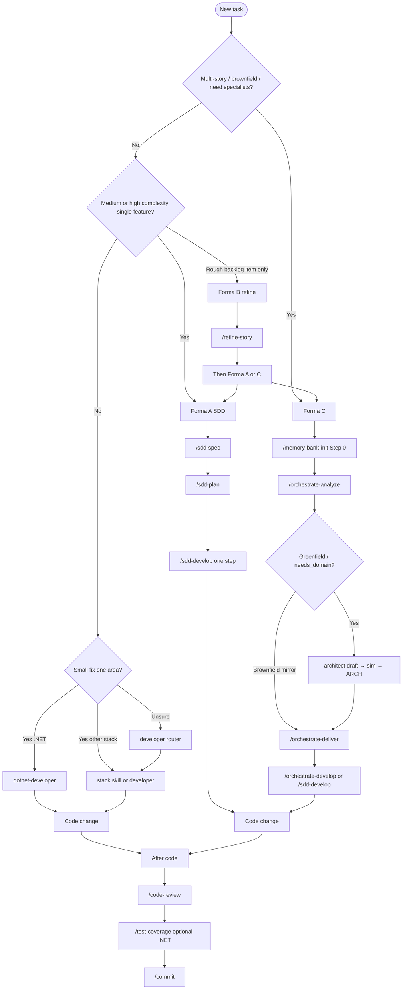

# Using skills

Invoke toolkit skills after a successful sync. Slash syntax below is the **Cursor** convention; other agents may use a skill picker, `@`-mention, or “use skill …” phrasing. Skill **ids** stay kebab-case folder names from `core/skills/`.

## Prerequisites

1. Synced at least one agent ([Get started](get-started.md)).
2. Opened a **consumer** project in that agent (not only this toolkit repo).
3. Optional: validated with `toolkit.ps1 -Action Validate -Agent <id>`.

## Which Forma / skill?



**ASCII summary:**

```
New task
  ├─ Multi-story / brownfield?     -> Forma C: memory-bank-init → analyze → deliver → develop
  ├─ Greenfield / needs domain?    -> Forma C: analyze (+ architect confirm) before develop
  ├─ Single medium/high feature?   -> Forma A: sdd-spec → sdd-plan → sdd-develop
  ├─ Rough backlog item?           -> Forma B: refine-story → checklist? → A or C
  ├─ Small stack change?           -> *-developer or /developer
  └─ After code                    -> code-review → test-coverage? → commit
```

### Formas A / B / C

| Forma | When | Pipeline | Notes |
|-------|------|----------|-------|
| **A** Classic | One clear feature | `sdd-spec` → `sdd-plan` → `sdd-develop` | No memory-bank required |
| **B** Backlog | Informal bug/story | `refine-story` → optional `split-story-checklist` → A or C | Prepares structured markdown |
| **C** Orchestrated | Multi-story / brownfield / greenfield domain | `memory-bank-init` → analyze → deliver → develop | Analyze may run architect confirm; deliver/develop reuse classic SDD |

Greenfield domain work: prefer Forma C so `/orchestrate-analyze` can spawn the roster **architect** (not a slash skill) — ARCH draft → you answer **sim** → ARCH approved — before implementers load one architecture style + stack overlay. Brownfield: discover-first (mirror existing ARCH).

## Invoke by agent

### Cursor

Skills: `~/.cursor/skills/<id>/SKILL.md`. Rules: `~/.cursor/rules/*.mdc`. Router: `AGENTS.md`.

| Action | Example |
|--------|---------|
| Slash menu | `/sdd-spec` |
| With args | `/sdd-plan - path/to/PRD.md` |
| Stack router | `/developer` |
| Forma C Step 0 | `/memory-bank-init` |

Trust hooks in Cursor’s UI once if prompted (outside CI).

### Claude Code

Skills under `~/.claude/skills/` (or project `.claude/`). Router: `CLAUDE.md`. Invoke via Claude’s skill / slash UX; names match kebab ids.

### GitHub Copilot

Sync with `-Mode user` or `-Mode repo`:

| Mode | Skills / instructions |
|------|------------------------|
| `user` | `~/.copilot/skills`, `instructions/`, `copilot-instructions.md` |
| `repo` | `<repo>/.github/skills`, … |

Use Copilot’s agent-skills / custom-instructions surfaces.

### Codex / OpenCode / Grok / ZCode / Antigravity

| Agent | Typical skills location | Tip |
|-------|-------------------------|-----|
| Codex | Plugin-bundled tree | Trust hooks with Codex `/hooks` after a real install |
| OpenCode | `~/.config/opencode/skills` | JS plugins under `plugins/` |
| Grok | `~/.grok/skills` | Trust via `/hooks-trust` if needed |
| ZCode | `~/.zcode/skills` | ADE filesystem |
| Antigravity | `~/.gemini/config/skills` | Official `config/*` layout |

Per-agent publish layouts: [Adapters](adapters.md).

## Common workflows

### Forma A

```text
/sdd-spec
/sdd-plan - <prd-path>
/sdd-develop - <plan-path> - Step N
```

One develop session = **one** PLAN step.

### Forma C

```text
/memory-bank-init
/orchestrate-analyze
```

Then `/orchestrate-deliver` and `/orchestrate-develop` (or `/sdd-develop`). Orchestrators **reuse** classic SDD contracts; they do not replace them.

### Small stack change

```text
/developer
```

or `/dotnet-developer`, `/react-developer`, `/python-developer`, …

### After implementation

```text
/code-review
/commit
/push
```

## Skills catalog (summary)

Canonical folders under `core/skills/` (**36 skills** + `_shared`). Shared packs under `_shared/` are not slash skills. There is **no** `/architect` slash skill — the architect path is spawned from `orchestrate-analyze`.

| Group | Skills |
|-------|--------|
| **Forma A** | `sdd-spec`, `sdd-plan`, `sdd-develop` |
| **Forma B** | `refine-story`, `split-story-checklist` |
| **Forma C** | `memory-bank-init`, `orchestrate-analyze`, `orchestrate-deliver`, `orchestrate-develop` |
| **Stack** | `developer` + `dotnet-`, `java-`, `react-`, `react-native-`, `angular-`, `vue-`, `blazor-`, `electron-`, `javascript-`, `python-developer` |
| **Design / Blip** | `impeccable`, `blip-plugin-developer` |
| **Operational** | `code-review`, `commit`, `push`, `refactor`, `repair-dotnet-build`, `test-coverage`, `ef-add-migration`, `scaffold-message-handler`, `api-integrate`, `performance-profile`, `containerize`, `i18n-manager` |

## Re-sync when skills feel stale

Fixture (safe):

```powershell
pwsh -NoProfile -File .\scripts\toolkit.ps1 -Action Sync -Agent cursor
```

Live Cursor home (explicit):

```powershell
pwsh -NoProfile -File .\scripts\sync-agent.ps1 -Agent cursor `
  -InstallRoot "$env:USERPROFILE\.cursor" -AllowUserHome
```

Managed files are overwritten; alien files in the agent home are preserved.

Next: [Get started](get-started.md) · [Adapters](adapters.md) · [Architecture](architecture.md) · [Home](index.md)
