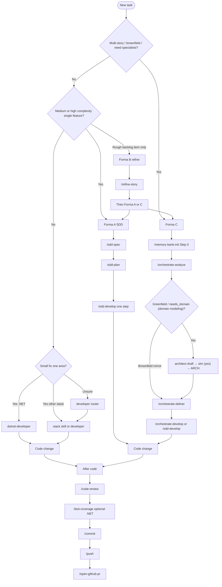

# Using skills

Invoke toolkit skills after a successful sync. Prefer **skill ids** (kebab-case folder names under `core/skills/`). Host UX varies: slash `/` when the agent supports it, skill picker, `@`-mention, or “use skill …” phrasing. Examples below often show slash form for brevity — the **id** is what matters across adapters.

After any agent sync, invoke skill **`help-skills`** for the installed static catalog (`CATALOG.md` + `OPERATOR.md`) — do not load every `SKILL.md`.

## Parallel specialists (default)

After sync, the published router asks agents to prefer **parallel specialist subagents** for planning, multi-facet execution, analysis, or non-trivial questions, keeping **this session as the parent**. Trivial / single-path work stays in-parent. Caps and fallback: `SPAWN.md` (see [Architecture](../architecture/)).

## Prerequisites

1. Synced at least one agent — see [Get started](../get-started/).
2. Opened an **application project** (the project you are building) in that agent — not only this toolkit repo.
3. Optional: validated with `toolkit.ps1 -Action Validate -Agent <id>`.

## Which workflow (Forma) / skill?



**ASCII summary:**

```
New task
  ├─ Multi-story / brownfield?     -> Forma C: memory-bank-init → analyze → deliver → develop
  ├─ Greenfield / needs_domain?    -> Forma C: analyze (+ architect confirm) before develop
  ├─ Single medium/high feature?   -> Forma A: sdd-spec → sdd-plan → sdd-develop
  ├─ Rough backlog item?           -> Forma B: refine-story → checklist? → A or C
  ├─ Small stack change?           -> *-developer or /developer
  └─ After code                    -> code-review → test-coverage? → commit → push → open-github-pr
```

### Workflows (Forma A / B / C)

| Forma | When | Pipeline | Notes |
|-------|------|----------|-------|
| **A** Classic | One clear feature | `sdd-spec` → `sdd-plan` → `sdd-develop` | No memory-bank required |
| **B** Backlog | Informal bug/story | `refine-story` → optional `split-story-checklist` → A or C | Prepares structured markdown |
| **C** Orchestrated | Multi-story / brownfield / greenfield domain | `memory-bank-init` → analyze → deliver → develop | Analyze may run architect confirm; deliver/develop reuse classic SDD |

For greenfield domain work, prefer Forma C. `/orchestrate-analyze` can start the roster **architect** specialist (not a slash skill). That path drafts ARCH → you answer **sim** (yes / confirm) → ARCH is approved, then implementers run. For brownfield work, prefer discovery first (**discover-first**): mirror the existing ARCH instead of re-picking.

## Invoke by agent

Skill **`help-skills`** works on **every** synced adapter (not Codex-only).

### Cursor

Skills: `~/.cursor/skills/<id>/SKILL.md`. Rules: `~/.cursor/rules/*.mdc`. Router: `AGENTS.md`.

| Action | Example |
|--------|---------|
| Slash menu | `/sdd-spec` |
| With args | `/sdd-plan - path/to/PRD.md` |
| Stack router | `/developer` |
| Catalog | `/help-skills` |
| Forma C Step 0 | `/memory-bank-init` |

Trust hooks in Cursor’s UI once if prompted (outside CI).

### Claude Code

Skills under `~/.claude/skills/` (or project `.claude/`). Router: `CLAUDE.md`. Invoke via Claude’s skill / slash UX; names match kebab ids. Catalog: `help-skills`.

### GitHub Copilot

Sync with `-Mode user` or `-Mode repo`:

| Mode | Skills / instructions |
|------|------------------------|
| `user` | `~/.copilot/skills`, `instructions/`, `copilot-instructions.md` |
| `repo` | `<repo>/.github/skills`, … |

Use Copilot’s agent-skills / custom-instructions surfaces. Catalog skill id: `help-skills`.

### Codex

Codex is **dual-root** — plugin skills and InstallRoot rules are not one shared `TOOLKIT_ROOT`:

| Surface | Location |
|---------|----------|
| Plugin skills + CATALOG + OPERATOR | Under `InstallRoot/plugin` (default sync) |
| Rules (Publish-Policy) | `InstallRoot/rules/*.md` |
| Product / AGENTS / hooks | `InstallRoot` (live `~/.codex`) |
| Optional USER skills | Fixture `InstallRoot/.agents/skills` · live `~/.agents/skills` with `-UserScope` + `-AllowUserHome` |

Default sync is **plugin-only**. Invoke `help-skills` for the installed catalog — do not load every `SKILL.md`. Trust hooks with Codex `/hooks` after a real install (smoke never requires it).

### OpenCode / Grok / ZCode / Antigravity

| Agent | Typical skills location | Tip |
|-------|-------------------------|-----|
| OpenCode | `~/.config/opencode/skills` | JS plugins under `plugins/` |
| Grok | `~/.grok/skills` | Trust via `/hooks-trust` if needed |
| ZCode | `~/.zcode/skills` | ADE (agent filesystem) |
| Antigravity | `~/.gemini/config/skills` | Official `config/*` layout |

Per-agent publish layouts: [Adapters](../adapters/). All publish `help-skills` + the skills-catalog pack.

## Common workflows

### Forma A

```text
/sdd-spec
/sdd-plan - <prd-path>
/sdd-develop - <plan-path> - Step N
```

One develop session = **one** PLAN step.

### Forma C

```text
/memory-bank-init
/orchestrate-analyze
```

Then `/orchestrate-deliver` and `/orchestrate-develop` (or `/sdd-develop`). Orchestrators **reuse** classic SDD contracts; they do not replace them.

### Small stack change

```text
/developer
```

or `/dotnet-developer`, `/react-developer`, `/python-developer`, …

### After implementation

```text
/code-review
/commit
/push
/open-github-pr
```

Feature PRs: current `feature/*` (or `feat/*`) → `develop`. Release mode: `develop` → `master`/`main`. Prefer `/open-github-pr` over the web UI when `gh` is available.

## Skills catalog (summary)

Canonical folders under `core/skills/` (**38 skills** + `_shared`). Agent SoT: skill `help-skills` → `_shared/skills-catalog/CATALOG.md` (map) + `OPERATOR.md` (confirmations, options, quirks — do not load every `SKILL.md`). Shared packs under `_shared/` are not slash skills. There is **no** `architect` slash skill — the architect path is spawned from `orchestrate-analyze`.

| Group | Skills |
|-------|--------|
| **Forma A** | `sdd-spec`, `sdd-plan`, `sdd-develop` |
| **Forma B** | `refine-story`, `split-story-checklist` |
| **Forma C** | `memory-bank-init`, `orchestrate-analyze`, `orchestrate-deliver`, `orchestrate-develop` |
| **Stack** | `developer` + `dotnet-`, `java-`, `react-`, `react-native-`, `angular-`, `vue-`, `blazor-`, `electron-`, `javascript-`, `python-developer` |
| **Design / Blip** | `impeccable`, `blip-plugin-developer` |
| **Docs RAG** | `document-plan`, `document-implement` |
| **Operational** | `help-skills`, `code-review`, `commit`, `push`, `open-github-pr`, `refactor`, `repair-dotnet-build`, `test-coverage`, `ef-add-migration`, `scaffold-message-handler`, `api-integrate`, `performance-profile`, `containerize`, `i18n-manager` |

### Operator expectations (high level)

| Area | What you will be asked / options |
|------|----------------------------------|
| Git (`commit` / `push` / `open-github-pr`) | Confirm commit message; confirm push; PR mode feature vs release; confirm title/body; **always** ask auto-merge. Deep dive: [git-ops.md](https://github.com/tibursocampos/agent-dev-toolkit/blob/master/docs/domains/git-ops.md) |
| `code-review` | Choose single vs multi-angle (no silent default) |
| Forma C | Memory-bank Step 0; backlog **sim**; architect ARCH draft → **sim** on greenfield / `needs_domain` |
| `sdd-develop` | One PLAN step per session |
| `document-plan` | Asks doc language before writing |
| Caveman | Default OFF; `caveman on\|off\|status\|lite\|full\|ultra` — [Caveman mode](../caveman/) |

Installed static notes: `_shared/skills-catalog/OPERATOR.md` (via `help-skills`).

## Re-sync when skills feel stale

Fixture (safe) — any Tier-1 id:

```powershell
pwsh -NoProfile -File .\scripts\toolkit.ps1 -Action Sync -Agent claude
```

Live install example (Claude):

```powershell
pwsh -NoProfile -File .\scripts\sync-agent.ps1 -Agent claude `
  -InstallRoot "$env:USERPROFILE\.claude" -AllowUserHome
```

Live Cursor:

```powershell
pwsh -NoProfile -File .\scripts\sync-agent.ps1 -Agent cursor `
  -InstallRoot "$env:USERPROFILE\.cursor" -AllowUserHome
```

Managed files are overwritten; **non-toolkit** (alien) files in the agent install root are preserved.

Next: [Get started](../get-started/) · [Adapters](../adapters/) · [Architecture](../architecture/) · [Caveman](../caveman/) · [Home](../)
