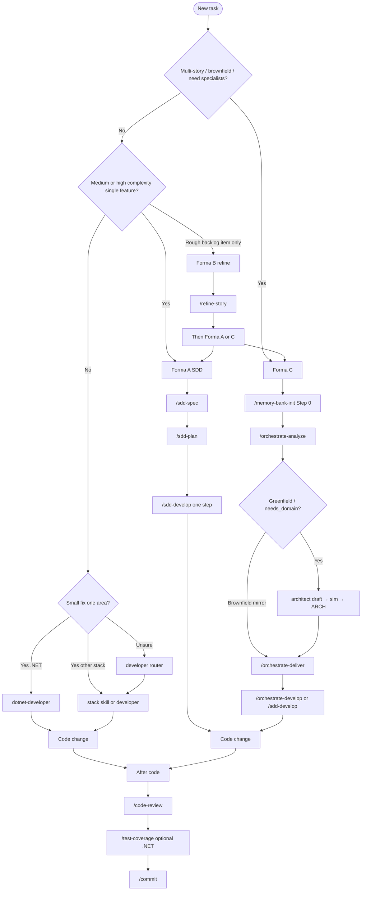

# Usando skills

Invoque as skills do toolkit após um sync bem-sucedido. A sintaxe slash abaixo é a convenção do **Cursor**; outros agentes podem usar seletor de skill, `@`-mention ou frases do tipo “use skill …”. Os **ids** das skills permanecem kebab-case (nomes de pasta em `core/skills/`).

## Pré-requisitos

1. Sync de pelo menos um agente — ver [Começar](../get-started/).
2. Projeto **consumidor** aberto nesse agente (não só este repositório do toolkit).
3. Opcional: validação com `toolkit.ps1 -Action Validate -Agent <id>`.

## Qual Forma / skill?



**Resumo ASCII:**

```
Nova tarefa
  ├─ Multi-story / brownfield?     -> Forma C: memory-bank-init → analyze → deliver → develop
  ├─ Greenfield / precisa domínio? -> Forma C: analyze (+ confirmação architect) antes de develop
  ├─ Feature única média/alta?     -> Forma A: sdd-spec → sdd-plan → sdd-develop
  ├─ Item de backlog rudimentar?   -> Forma B: refine-story → checklist? → A ou C
  ├─ Mudança pequena de stack?     -> *-developer ou /developer
  └─ Depois do código              -> code-review → test-coverage? → commit
```

### Formas A / B / C

| Forma | Quando | Pipeline | Notas |
|-------|--------|----------|-------|
| **A** Clássica | Uma feature clara | `sdd-spec` → `sdd-plan` → `sdd-develop` | Sem memory-bank obrigatório |
| **B** Backlog | Bug/story informal | `refine-story` → `split-story-checklist` opcional → A ou C | Prepara markdown estruturado |
| **C** Orquestrada | Multi-story / brownfield / domínio greenfield | `memory-bank-init` → analyze → deliver → develop | Analyze pode pedir confirmação do architect; deliver/develop reusam SDD clássico |

Trabalho de domínio greenfield: prefira Forma C para que `/orchestrate-analyze` possa spawnar o roster **architect** (não é skill slash) — rascunho ARCH → você responde **sim** → ARCH aprovado — antes dos implementadores carregarem um estilo de arquitetura + overlay de stack. Brownfield: discover-first (espelhar ARCH existente).

## Invocar por agente

### Cursor

Skills: `~/.cursor/skills/<id>/SKILL.md`. Rules: `~/.cursor/rules/*.mdc`. Router: `AGENTS.md`.

| Ação | Exemplo |
|------|---------|
| Menu slash | `/sdd-spec` |
| Com args | `/sdd-plan - path/to/PRD.md` |
| Router de stack | `/developer` |
| Forma C Step 0 | `/memory-bank-init` |

Confie nos hooks na UI do Cursor uma vez se solicitado (fora de CI).

### Claude Code

Skills em `~/.claude/skills/` (ou `.claude/` do projeto). Router: `CLAUDE.md`. Invoque via UX de skill / slash do Claude; nomes batem com ids kebab-case.

### GitHub Copilot

Sync com `-Mode user` ou `-Mode repo`:

| Mode | Skills / instructions |
|------|------------------------|
| `user` | `~/.copilot/skills`, `instructions/`, `copilot-instructions.md` |
| `repo` | `<repo>/.github/skills`, … |

Use as superfícies agent-skills / custom-instructions do Copilot.

### Codex / OpenCode / Grok / ZCode / Antigravity

| Agente | Local típico das skills | Dica |
|--------|-------------------------|------|
| Codex | Árvore empacotada no plugin | Confie nos hooks com Codex `/hooks` após install real |
| OpenCode | `~/.config/opencode/skills` | Plugins JS em `plugins/` |
| Grok | `~/.grok/skills` | Confie via `/hooks-trust` se necessário |
| ZCode | `~/.zcode/skills` | Filesystem ADE |
| Antigravity | `~/.gemini/config/skills` | Layout oficial `config/*` |

Layouts de publish por agente: [Adapters](../adapters/).

## Fluxos comuns

### Forma A

```text
/sdd-spec
/sdd-plan - <prd-path>
/sdd-develop - <plan-path> - Step N
```

Uma sessão de develop = **um** passo do PLAN.

### Forma C

```text
/memory-bank-init
/orchestrate-analyze
```

Depois `/orchestrate-deliver` e `/orchestrate-develop` (ou `/sdd-develop`). Orquestradores **reusam** contratos SDD clássicos; não os substituem.

### Mudança pequena de stack

```text
/developer
```

ou `/dotnet-developer`, `/react-developer`, `/python-developer`, …

### Depois da implementação

```text
/code-review
/commit
/push
```

## Catálogo de skills (resumo)

Pastas canônicas em `core/skills/` (**36 skills** + `_shared`). Packs em `_shared/` não são skills slash. **Não** existe skill slash `/architect` — o caminho architect é spawnado a partir de `orchestrate-analyze`.

| Grupo | Skills |
|-------|--------|
| **Forma A** | `sdd-spec`, `sdd-plan`, `sdd-develop` |
| **Forma B** | `refine-story`, `split-story-checklist` |
| **Forma C** | `memory-bank-init`, `orchestrate-analyze`, `orchestrate-deliver`, `orchestrate-develop` |
| **Stack** | `developer` + `dotnet-`, `java-`, `react-`, `react-native-`, `angular-`, `vue-`, `blazor-`, `electron-`, `javascript-`, `python-developer` |
| **Design / Blip** | `impeccable`, `blip-plugin-developer` |
| **Operacional** | `code-review`, `commit`, `push`, `refactor`, `repair-dotnet-build`, `test-coverage`, `ef-add-migration`, `scaffold-message-handler`, `api-integrate`, `performance-profile`, `containerize`, `i18n-manager` |

## Re-sync quando as skills parecerem desatualizadas

Fixture (seguro):

```powershell
pwsh -NoProfile -File .\scripts\toolkit.ps1 -Action Sync -Agent cursor
```

Home live do Cursor (explícito):

```powershell
pwsh -NoProfile -File .\scripts\sync-agent.ps1 -Agent cursor `
  -InstallRoot "$env:USERPROFILE\.cursor" -AllowUserHome
```

Arquivos gerenciados são sobrescritos; arquivos alienígenas no home do agente são preservados.

Próximo: [Começar](../get-started/) · [Adapters](../adapters/) · [Arquitetura](../architecture/) · [Início](../)
