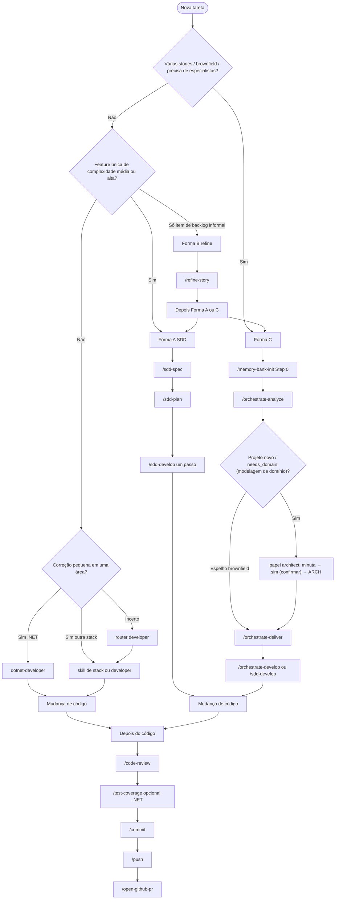

# Usando skills

Invoque as skills do toolkit após um sync bem-sucedido. Prefira **ids de skill** (kebab-case em `core/skills/`). O **id** é estável entre hosts; o prefixo é específico do host (`/`, `$`, `use skill` ou a ferramenta `skill` do OpenCode). Compat: `use skill <id>` ou linguagem natural alinhada à `description` da skill.

Após qualquer sync, invoque a skill **`help-skills`** para o catálogo estático instalado (`CATALOG.md` + `OPERATOR.md`) — não carregue cada `SKILL.md`.

**Não é invoke de skill:** Codex `/hooks` e Grok `/hooks-trust` são UI de trust de hooks. Não existe flag de produto Codex `$skill --menu` — `$` / `/skills` é o picker nativo de skills.

## Matriz canônica de invoke

| Host | Path das skills (live, típico) | Forma explícita | Exemplo |
|------|--------------------------------|-----------------|---------|
| Cursor | `~/.cursor/skills` | `/id` | `/help-skills` |
| Claude | `~/.claude/skills` | `/id` | `/sdd-spec` |
| Codex | `~/.codex/skills` (+ opcional `~/.agents/skills`) | `$id` | `$help-skills` |
| Copilot | `~/.copilot/skills` ou `<repo>/.github/skills` | `/id` (+ `/skills reload` após sync) | `/dotnet-developer` |
| OpenCode | `~/.config/opencode/skills` | ferramenta `skill` | `skill({ name: "help-skills" })` |
| Antigravity | `~/.gemini/config/skills` | `use skill id` ou `/id` | `use skill sdd-plan` |
| Grok | `~/.grok/skills` | `/id` | `/help-skills` |
| ZCode | `~/.zcode/skills` | `$id` | `$help-skills` |

## Especialistas em paralelo (padrão)

Após o sync, o router publicado pede aos agentes que prefiram **subagentes especialistas em paralelo** para planejamento, execução multi-facet, análise ou dúvidas não triviais, mantendo **esta sessão como pai**. Trabalho trivial / single-path fica no pai.

- **`needs_*` → roster** — quais papéis spawnar: [ROSTER.md](https://github.com/tibursocampos/agent-dev-toolkit/blob/master/core/skills/_shared/agents/ROSTER.md)
- **`model` no Task** — omitir por padrão (o filho herda o modelo da sessão pai); ver [SUBAGENT-MODEL.md](https://github.com/tibursocampos/agent-dev-toolkit/blob/master/core/skills/_shared/agents/SUBAGENT-MODEL.md)
- **Pai orquestrador** — esta sessão fica enxuta (metas, gates, paths, receipts); **sem código da aplicação** no pai quando há especialistas
- **Caps** — filhos `*-developer` **≤ 2**; paralelo `orchestrate-*` **≤ 4** (em ondas se houver mais). Fallback com `subagents=none`: no pai, nunca hard-fail — [docs/SPAWN.md](https://github.com/tibursocampos/agent-dev-toolkit/blob/master/docs/SPAWN.md) · [Arquitetura](../architecture/)

## Pré-requisitos

1. Sync de pelo menos um agente — ver [Começar](../get-started/).
2. **Projeto da aplicação** aberto nesse agente (não só este repositório do toolkit).
3. Opcional: validação com `toolkit.ps1 -Action Validate -Agent <id>`.

## Qual Forma / skill?



**Resumo ASCII:**

```
Nova tarefa
  ├─ Várias stories / brownfield?        -> Forma C: memory-bank-init → analyze → deliver → develop
  ├─ Projeto novo / precisa domínio?     -> Forma C: analyze (+ confirmação architect) antes de develop
  ├─ Feature única média/alta?           -> Forma A: sdd-spec → sdd-plan → sdd-develop
  ├─ Item de backlog informal?           -> Forma B: refine-story → checklist? → A ou C
  ├─ Mudança pequena de stack?           -> *-developer ou developer
  └─ Depois do código                    -> code-review → test-coverage? → commit → push → open-github-pr
```

### Formas A / B / C

| Forma | Quando | Pipeline | Notas |
|-------|--------|----------|-------|
| **A** Clássica | Uma feature clara | `sdd-spec` → `sdd-plan` → `sdd-develop` | Sem memory-bank obrigatório |
| **B** Backlog | Bug/story informal | `refine-story` → `split-story-checklist` opcional → A ou C | Prepara markdown estruturado |
| **C** Orquestrada | Várias stories / brownfield / domínio em projeto novo (greenfield) | `memory-bank-init` → analyze → deliver → develop | Analyze pode pedir confirmação do architect; deliver/develop reusam SDD clássico |

Trabalho de domínio em projeto novo (greenfield): prefira Forma C. Assim `orchestrate-analyze` pode acionar o papel **architect** do roster (não é skill id). Ele gera uma minuta ARCH; você responde **sim** (confirmar); o ARCH fica aprovado. Só então os implementadores carregam um estilo de arquitetura e a camada de stack correspondente. Em brownfield, use descoberta primeiro: espelhe o ARCH existente.

## Invocar por agente

A skill **`help-skills`** funciona em **todos** os adapters sincronizados (não só Codex). Use a forma do host na matriz acima.

### Cursor

Skills: `~/.cursor/skills/<id>/SKILL.md`. Rules: `~/.cursor/rules/*.mdc`. Router: `AGENTS.md`.

| Ação | Exemplo |
|------|---------|
| Menu slash | `/sdd-spec` |
| Com args | `/sdd-plan - path/to/PRD.md` |
| Router de stack | `/developer` |
| Catálogo | `/help-skills` |
| Forma C Step 0 | `/memory-bank-init` |

Também Customize → Skills. Aceite os hooks na UI do Cursor uma vez se solicitado (fora de CI).

### Claude Code

Skills em `~/.claude/skills/` (ou `.claude/` do projeto). Router: `CLAUDE.md`. Invoque com `/id` (ex.: `/sdd-spec`, `/help-skills`).

### GitHub Copilot

Sync com `-Mode user` ou `-Mode repo`:

| Mode | Skills / instruções |
|------|---------------------|
| `user` | `~/.copilot/skills`, `instructions/`, `copilot-instructions.md` |
| `repo` | `<repo>/.github/skills`, … |

Invoque com `/id`. Após o sync, rode **`/skills reload`**. Id do catálogo: `help-skills`.

### Codex

O Codex é **dual-root** para packaging vs rules. **O path do plugin sozinho não alimenta `$`.**

| Superfície | Local |
|------------|-------|
| Skills do plugin + CATALOG + OPERATOR | Sob `InstallRoot/plugin` (packaging) |
| **Discovery `$`** | Live `~/.codex/skills` (espelho em InstallRoot) |
| Rules (Publish-Policy) | `InstallRoot/rules/*.md` |
| Produto / AGENTS / hooks | `InstallRoot` (live `~/.codex`) |
| UserScope opcional (opt-in) | Fixture `InstallRoot/.agents/skills` · live `~/.agents/skills` |

Invoque com **`$id`** (ex.: `$help-skills`). O picker nativo `$` / `/skills` é o menu do produto — não uma flag `--menu`. Aceite hooks com Codex `/hooks` após install real (UI de trust, não invoke de skill).

### OpenCode

Skills: `~/.config/opencode/skills`. Invoque via a ferramenta **`skill`**: `skill({ name: "help-skills" })`. Plugins JS em `plugins/`.

### Grok

Path live esperado: `~/.grok/skills`. Invoque com `/id` (ex.: `/help-skills`). Trust de hooks via `/hooks-trust` se necessário (não é invoke de skill).

### ZCode

Skills: `~/.zcode/skills`. Invoque com **`$id`** (ex.: `$help-skills`). Atualize em Settings → Skills se o produto exigir.

### Antigravity

Skills: `~/.gemini/config/skills`. Invoque com **`use skill <id>`** ou `/id` (ex.: `use skill sdd-plan`).

Layouts de publicação por agente: [Adaptadores](../adapters/). Todos publicam `help-skills` + o pack skills-catalog.

## Fluxos comuns

Exemplos de fluxo usam **ids de skill**. Prefixe com a forma do seu host (`/`, `$`, `use skill` ou a ferramenta `skill` do OpenCode).

### Forma A

```text
sdd-spec
sdd-plan - <prd-path>
sdd-develop - <plan-path> - Step N
```

Uma sessão de develop = **um** passo do PLAN.

### Forma C

```text
memory-bank-init
orchestrate-analyze
```

Depois `orchestrate-deliver` e `orchestrate-develop` (ou `sdd-develop`). Orquestradores **reusam** contratos SDD clássicos; não os substituem.

### Mudança pequena de stack

```text
developer
```

ou `dotnet-developer`, `react-developer`, `python-developer`, …

### Depois da implementação

```text
code-review
commit
push
open-github-pr
```

PRs de feature: `feature/*` (ou `feat/*`) atual → `develop`. Modo release: `develop` → `master`/`main`. Prefira `open-github-pr` à UI web quando `gh` estiver disponível.

## Catálogo de skills (resumo)

Pastas canônicas em `core/skills/` (**38 skills** + `_shared`). SoT do agente: skill `help-skills` → `_shared/skills-catalog/CATALOG.md` (mapa) + `OPERATOR.md` (confirmações, opções, nuances — não carregue cada `SKILL.md`). Packs em `_shared/` não são skills invocáveis. **Não** existe skill `architect` — o caminho architect é acionado a partir de `orchestrate-analyze`.

| Grupo | Skills |
|-------|--------|
| **Forma A** | `sdd-spec`, `sdd-plan`, `sdd-develop` |
| **Forma B** | `refine-story`, `split-story-checklist` |
| **Forma C** | `memory-bank-init`, `orchestrate-analyze`, `orchestrate-deliver`, `orchestrate-develop` |
| **Stack** | `developer` + `dotnet-`, `java-`, `react-`, `react-native-`, `angular-`, `vue-`, `blazor-`, `electron-`, `javascript-`, `python-developer` |
| **Design / Blip** | `impeccable`, `blip-plugin-developer` |
| **Docs RAG** | `document-plan`, `document-implement` |
| **Operacional** | `help-skills`, `code-review`, `commit`, `push`, `open-github-pr`, `refactor`, `repair-dotnet-build`, `test-coverage`, `ef-add-migration`, `scaffold-message-handler`, `api-integrate`, `performance-profile`, `containerize`, `i18n-manager` |

### Expectativas do operador (visão geral)

| Área | O que será pedido / opções |
|------|----------------------------|
| Git (`commit` / `push` / `open-github-pr`) | Confirmar mensagem de commit; confirmar push; modo PR feature vs release; confirmar título/corpo; **sempre** perguntar auto-merge. Detalhe: [git-ops.md](https://github.com/tibursocampos/agent-dev-toolkit/blob/master/docs/domains/git-ops.md) |
| `code-review` | Escolher single vs multi-angle (sem default silencioso) |
| Forma C | Memory-bank Step 0; backlog **sim**; rascunho ARCH do architect → **sim** em greenfield / `needs_domain` |
| `sdd-develop` | Um passo do PLAN por sessão |
| `document-plan` | Pergunta o idioma da doc antes de escrever |
| Caveman | Default OFF; `caveman on\|off\|status\|lite\|full\|ultra` — [Modo Caveman](../caveman/) |

Notas estáticas instaladas: `_shared/skills-catalog/OPERATOR.md` (via `help-skills`).

## Re-sync quando as skills parecerem desatualizadas

Fixture (seguro) — qualquer id Tier-1:

```powershell
pwsh -NoProfile -File .\scripts\toolkit.ps1 -Action Sync -Agent claude
```

Exemplo live (Claude):

```powershell
pwsh -NoProfile -File .\scripts\sync-agent.ps1 -Agent claude `
  -InstallRoot "$env:USERPROFILE\.claude" -AllowUserHome
```

Live Cursor:

```powershell
pwsh -NoProfile -File .\scripts\sync-agent.ps1 -Agent cursor `
  -InstallRoot "$env:USERPROFILE\.cursor" -AllowUserHome
```

Arquivos gerenciados são sobrescritos; arquivos não gerenciados (externos) no ambiente do agente são preservados.

Próximo: [Começar](../get-started/) · [Adaptadores](../adapters/) · [Arquitetura](../architecture/) · [Caveman](../caveman/) · [Início](../)
