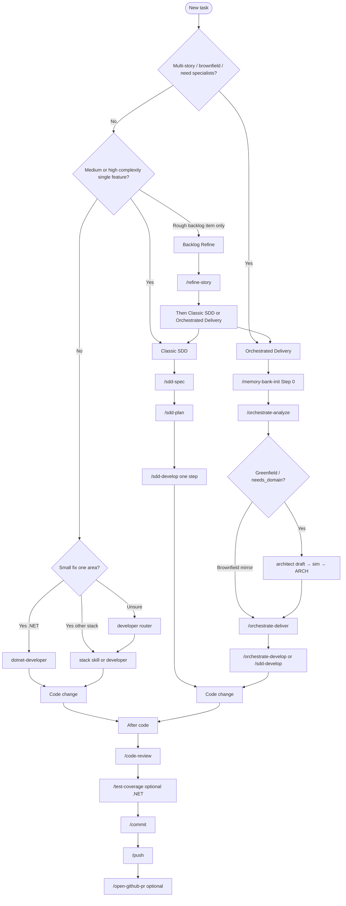

# User guides

Onboarding hub for **agent-dev-toolkit**. Start here after [install / sync](../INSTALL.md) — you should not need to read every `SKILL.md` under the agent home for daily work.

**Audience:** developers using any supported agent with this toolkit’s skills.

**Language:** guides are in **English**. Chat language may follow synced policy (e.g. pt-BR user-language rules). Application source code stays English unless you decide otherwise.

---

## What this toolkit is

A **multi-agent** skills and policy pack: work tracks **Classic SDD** / **Backlog Refine** / **Orchestrated Delivery** *(formerly Forma A/B/C — alias this release only)* for Spec-Driven Development, stack `*-developer` shortcuts, Git flow (`commit` / `push` / optional `open-github-pr`), optional Caveman compression (via policy), and in-repo validation. Deploy once with option 1 — `pwsh -NoProfile -File .\scripts\toolkit.ps1` — then open any **consumer** project and invoke skills. Scripting/CI: `-Action Sync` or `sync-agent.ps1 -Agent <id>`.

**Same call flow:** skill ids and slash/`$id` handoffs stay; internal contracts add gates and artifacts (REQ, validate, CHANGE, EVD, STATE, TRACE, selective retrieval) — not a second toolkit or SQLite/FTS deliverable.

---

## Getting started

1. Clone and sync. Follow [Install](../INSTALL.md) (option 1 = interactive `toolkit.ps1`) and [01 - Getting started](01-getting-started.md).
2. Open the **project you are building** in your agent (not only this toolkit repo).
3. Use the [decision tree](#which-skill-should-i-use) below, then [02 - Using skills](02-using-skills.md).

Re-run option 1 (`toolkit.ps1` → Sync agent) after `git pull` so published skills stay current. Scripting: `sync-agent.ps1`.

---

## Which skill should I use?



**ASCII summary:**

```
New task
  ├─ Multi-story / brownfield?     -> Orchestrated Delivery: memory-bank-init -> O1 -> O2 -> O3|sdd-develop
  ├─ Greenfield / needs domain?    -> Orchestrated Delivery: O1 (+ architect confirm) before develop loads one style
  ├─ Single medium/high feature?   -> Classic SDD: sdd-spec -> sdd-plan -> sdd-develop
  ├─ Rough backlog item?           -> Backlog Refine: refine-story -> checklist? -> Classic or Orchestrated
  ├─ Small stack change?           -> *-developer or /developer
  └─ After code                    -> code-review -> test-coverage? -> commit -> push -> open-github-pr?
```

**Greenfield domain:** use Orchestrated Delivery *(formerly Forma C)* — `/orchestrate-analyze` spawns the roster **architect** when needed; confirm ARCH (**sim**) before implementers load one Layer B style + stack overlay C. Brownfield: discover-first (mirror existing ARCH). Details: [domains/core.md](../domains/core.md) § Code guidelines; [02-using-skills.md](02-using-skills.md).

---

## Work tracks

| Track | When | Pipeline | Notes |
|-------|------|----------|-------|
| **Classic SDD** *(formerly Forma A)* | One clear feature | `sdd-spec` → `sdd-plan` → `sdd-develop` | No memory-bank required |
| **Backlog Refine** *(formerly Forma B)* | Informal bug/story | `refine-story` → optional `split-story-checklist` → Classic or Orchestrated | Prepares structured markdown |
| **Orchestrated Delivery** *(formerly Forma C)* | Multi-story / brownfield / greenfield domain | Step 0 → O1 → O2 → O3 \| `sdd-develop` | O1 may run architect confirm; O2/O3 reuse Classic SDD |

Canonical contracts ship in `core/sdd/` and under `core/skills/_shared/sdd-artifacts/` (published with skills). Feature paths: `features/NNN-slug/{CHANGE.md,EVD/,STATE.md,TRACE.jsonl}`. Skill discovery after sync: `help-skills` (agent SoT `CATALOG.md` + `OPERATOR.md`) · human list: [SKILLS.md](../SKILLS.md).

---

## Guide index

| Guide | Content |
|-------|---------|
| [01-getting-started.md](01-getting-started.md) | Clone → sync → validate → first skill |
| [02-using-skills.md](02-using-skills.md) | How to invoke skills (incl. Codex dual-root + `help-skills`) |
| [07-caveman-mode.md](07-caveman-mode.md) | Caveman default OFF, commands, levels, Auto-Clarity |

Related:

| Doc | Content |
|-----|---------|
| [../INSTALL.md](../INSTALL.md) | Sync flags, live home, uninstall |
| [../VALIDATION.md](../VALIDATION.md) | validate-core + keyed uninstall asserts + AllowUserHome forward + 10 agent smokes (Copilot is a suite) |
| [../SKILLS.md](../SKILLS.md) | Full skill list |
| [../ADAPTERS.md](../ADAPTERS.md) | Per-agent publish layouts |

---

## After code — recommended chain

1. `/code-review` (choose angles if prompted)
2. Optional `/test-coverage` (.NET)
3. `/commit` then `/push` (with confirmation); optional `/open-github-pr` when opening a PR

---

## Caveman Mode

Optional response compression. **Default OFF.** Commands: `caveman on` / `off` / `status` / `lite` / `full` / `ultra` (aliases: `stop caveman`, `normal mode`). Full guide: [07-caveman-mode.md](07-caveman-mode.md). Does not change sync or validation scripts.
