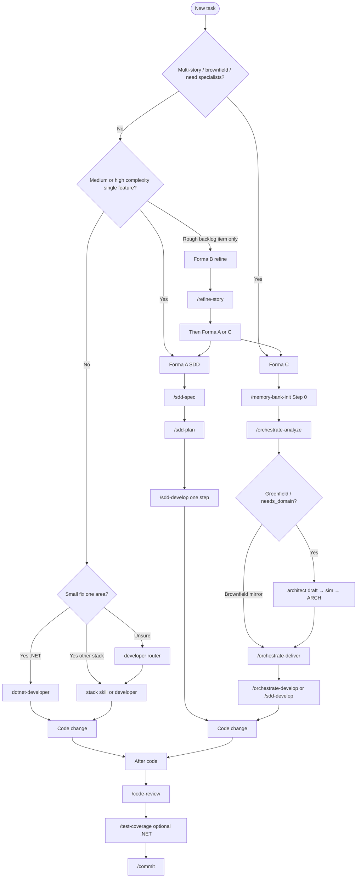

# User guides

Onboarding hub for **agent-dev-toolkit**. Start here after [install / sync](../INSTALL.md) — you should not need to read every `SKILL.md` under the agent home for daily work.

**Audience:** developers using any supported agent with this toolkit’s skills.

**Language:** guides are in **English**. Chat language may follow synced policy (e.g. pt-BR user-language rules). Application source code stays English unless you decide otherwise.

---

## What this toolkit is

A **multi-agent** skills and policy pack: Formas A / B / C for Spec-Driven Development, stack `*-developer` shortcuts, Git flow (`commit` / `push`), optional Caveman compression (via policy), and in-repo validation. Deploy once with `scripts/sync-agent.ps1 -Agent <id>`; then open any **consumer** project and invoke skills.

---

## Getting started

1. Clone and sync. Follow [Install](../INSTALL.md) and [01 - Getting started](01-getting-started.md).
2. Open the **project you are building** in your agent (not only this toolkit repo).
3. Use the [decision tree](#which-skill-should-i-use) below, then [02 - Using skills](02-using-skills.md).

Re-run `sync-agent.ps1` after `git pull` so published skills stay current.

---

## Which skill should I use?



**ASCII summary:**

```
New task
  ├─ Multi-story / brownfield?     -> Forma C: memory-bank-init -> O1 -> O2 -> O3|sdd-develop
  ├─ Greenfield / needs domain?    -> Forma C: O1 (+ architect confirm) before develop loads one style
  ├─ Single medium/high feature?   -> Forma A: sdd-spec -> sdd-plan -> sdd-develop
  ├─ Rough backlog item?           -> Forma B: refine-story -> checklist? -> A or C
  ├─ Small stack change?           -> *-developer or /developer
  └─ After code                    -> code-review -> test-coverage? -> commit
```

**Greenfield domain:** use Forma C — `/orchestrate-analyze` spawns the roster **architect** when needed; confirm ARCH (**sim**) before implementers load one Layer B style + stack overlay C. Brownfield: discover-first (mirror existing ARCH). Details: [domains/core.md](../domains/core.md) § Code guidelines; [02-using-skills.md](02-using-skills.md).

---

## Formas A / B / C

| Forma | When | Pipeline | Notes |
|-------|------|----------|-------|
| **A** Classic | One clear feature | `sdd-spec` → `sdd-plan` → `sdd-develop` | No memory-bank required |
| **B** Backlog | Informal bug/story | `refine-story` → optional `split-story-checklist` → A or C | Prepares structured markdown |
| **C** Orchestrated | Multi-story / brownfield / greenfield domain | Step 0 → O1 → O2 → O3 \| `sdd-develop` | O1 may run architect confirm; O2/O3 reuse classic SDD |

Canonical contracts ship in `core/sdd/` and under `core/skills/_shared/sdd-artifacts/` (published with skills). Catalog: [SKILLS.md](../SKILLS.md).

---

## Guide index

| Guide | Content |
|-------|---------|
| [01-getting-started.md](01-getting-started.md) | Clone → sync → validate → first `/sdd-spec` |
| [02-using-skills.md](02-using-skills.md) | How to invoke skills in Cursor, Claude, Copilot, and others |

Related:

| Doc | Content |
|-----|---------|
| [../INSTALL.md](../INSTALL.md) | Sync flags, live home, uninstall |
| [../VALIDATION.md](../VALIDATION.md) | validate-core + keyed uninstall asserts + AllowUserHome forward + 8 agent smokes |
| [../SKILLS.md](../SKILLS.md) | Full skill list |
| [../ADAPTERS.md](../ADAPTERS.md) | Per-agent publish layouts |

---

## After code — recommended chain

1. `/code-review` (choose angles if prompted)
2. Optional `/test-coverage` (.NET)
3. `/commit` then `/push` (with confirmation)

---

## Caveman Mode

Optional response compression is controlled by synced policy / preferences (e.g. `caveman on` / `caveman off` in chat when the rule is active). It does not change sync or validation scripts.
