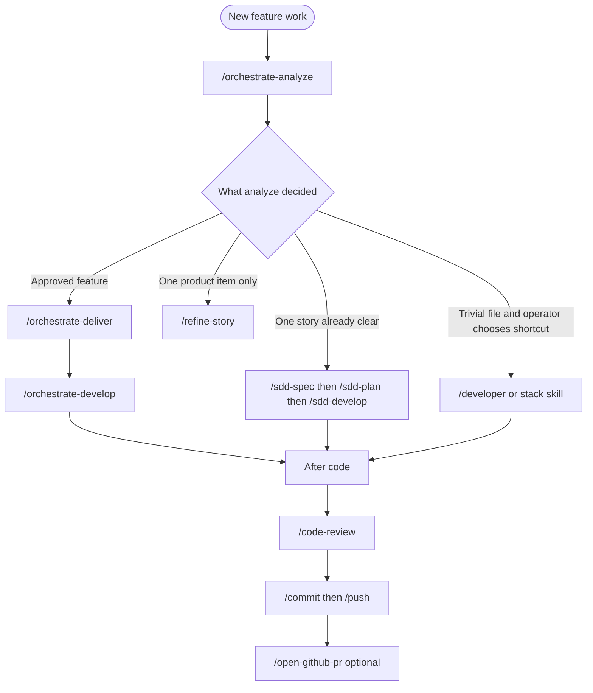

# User guides

Onboarding hub for **agent-dev-toolkit**. Start here after [install / sync](../INSTALL.md) — you should not need to read every `SKILL.md` under the agent home for daily work.

**Audience:** developers using any supported agent with this toolkit’s skills.

**Language:** guides are in **English**. User chat and persisted artifacts follow the operator’s chat language; spawn / Task child prompts and agent receipts stay **en-US** (`core/skills/_shared/agents/LANGUAGE.md`). Application source code stays English.

---

## What this toolkit is

A **multi-agent** skills and policy pack. The complete feature path is **Orchestrated Delivery** (`orchestrate-analyze` → `orchestrate-deliver` → `orchestrate-develop`). Deliver and develop run the Classic SDD contracts (`sdd-spec`, `sdd-plan`, `sdd-develop`). A one-file change uses `developer` or a stack skill. Git flow is `commit` / `push` / optional `open-github-pr`. Chat language, the parent orchestrator, and optional response compression are in [session-behavior.md](session-behavior.md). Prefer **Option 0** Release bootstrap ([INSTALL.md § 0](../INSTALL.md#0-release-bootstrap-https--checksum--toolkit)), or after clone run `pwsh -NoProfile -File .\scripts\toolkit.ps1`. Scripting/CI: `-Action Sync` or `sync-agent.ps1 -Agent <id>`.

**Same call flow:** skill ids and slash/`$id` handoffs stay; internal contracts add gates and artifacts (REQ, validate, CHANGE, EVD, STATE, TRACE, selective retrieval) — not a second toolkit or SQLite/FTS deliverable.

---

## Getting started

1. Clone and sync. Follow [Install](../INSTALL.md) (option 1 = interactive `toolkit.ps1`) and [01 - Getting started](01-getting-started.md).
2. Open the **project you are building** in your agent (not only this toolkit repo).
3. Use the [decision tree](#which-skill-should-i-use) below, then [02 - Using skills](02-using-skills.md).

Re-run option 1 (`toolkit.ps1` → Sync agent) after `git pull` so published skills stay current. Scripting: `sync-agent.ps1`.

---

## Which skill should I use?



**ASCII summary:**

```
Feature
  └─ orchestrate-analyze
        ├─ classifies, asks, sets needs_*, specialists, story gates, sim
        ├─ trivial one-file → /developer (only if the operator picks that shortcut)
        ├─ one already-clear story → sdd-spec (direct contract)
        └─ approved backlog → orchestrate-deliver
              └─ sdd-spec then sdd-plan per story → orchestrate-develop
                    └─ one sdd-develop step per child → code-review or commit
```

Full mechanics: [sessions/01-orchestrated-delivery.md](../sessions/01-orchestrated-delivery.md). Every skill: [sessions/09-every-skill.md](../sessions/09-every-skill.md).

**Greenfield domain:** `/orchestrate-analyze` spawns the roster **architect** when `needs_domain` or no style exists; ARCH stays a draft until **sim**. Brownfield mirrors the existing style. Layers A/B/C: [sessions/04-implement-and-guidelines.md](../sessions/04-implement-and-guidelines.md).

---

## How the paths relate

Orchestrated Delivery is the complete path. O2 loads `sdd-spec` then `sdd-plan`. O3 loads `sdd-develop` for one PLAN step. O1 applies the refine scorecard itself.

A direct `/sdd-spec` remains valid when one story is already clear (`core/router/AGENTS.md` still allows that start). `/refine-story` remains valid for a single product item, or when O2 stops on open clarification B/I. Those are exits from the complete path, not a second equal product.

| Path | When | Page |
|------|------|------|
| Orchestrated Delivery | Feature, specialists, several stories | [sessions/01](../sessions/01-orchestrated-delivery.md) |
| Classic SDD contracts | One clear story, or the contracts O2/O3 run | [sessions/02](../sessions/02-classic-sdd.md) |
| Backlog shape | Product-only item, or blocking questions | [sessions/03](../sessions/03-backlog-shape.md) |

Canonical contracts ship in `core/sdd/` and under `core/skills/_shared/sdd-artifacts/` (published with skills). Feature paths: `features/NNN-slug/{CHANGE.md,EVD/,STATE.md,TRACE.jsonl}`. Skill discovery after sync: `help-skills` (agent SoT `CATALOG.md` + `OPERATOR.md`) · human list: [SKILLS.md](../SKILLS.md).

---

## Guide index

| Guide | Content |
|-------|---------|
| [01-getting-started.md](01-getting-started.md) | Clone → sync → validate → first skill |
| [02-using-skills.md](02-using-skills.md) | How to invoke skills (incl. Codex dual-root + `help-skills`) |
| [session-behavior.md](session-behavior.md) | Chat language, parent orchestrator, optional compression |
| [08-orchestrator-mode.md](08-orchestrator-mode.md) | Orchestrator default always, charter, commands |
| [09-authorship-git-notes.md](09-authorship-git-notes.md) | Opt-in authorship git-notes (default off); TRACE remains SoT |

Related:

| Doc | Content |
|-----|---------|
| [../INSTALL.md](../INSTALL.md) | Sync flags, live home, uninstall |
| [../VALIDATION.md](../VALIDATION.md) | validate-core + keyed uninstall asserts + AllowUserHome forward + 10 agent smokes (Copilot is a suite) |
| [../sessions/README.md](../sessions/README.md) | How skills relate, session by session |
| [../SKILLS.md](../SKILLS.md) | Skill list (points at the session pages) |
| [../ADAPTERS.md](../ADAPTERS.md) | Per-agent publish layouts |

---

## After code — recommended chain

1. `/code-review` (choose angles if prompted)
2. Optional `/test-coverage` (.NET)
3. `/commit` then `/push` (with confirmation); optional `/open-github-pr` when opening a PR (feature **squash** → `develop`; release **rebase** → `main`/`master`)

---

## Session behavior

Chat language, parent orchestrator, and optional response compression (`caveman` default off) are one page: [session-behavior.md](session-behavior.md). Compression does not change skill steps.

## Orchestrator mode

Parent stays lean; specialists do heavy work. **Default `always`.** Commands: `orchestrator always` / `adaptive` / `status`. Full guide: [08-orchestrator-mode.md](08-orchestrator-mode.md).
